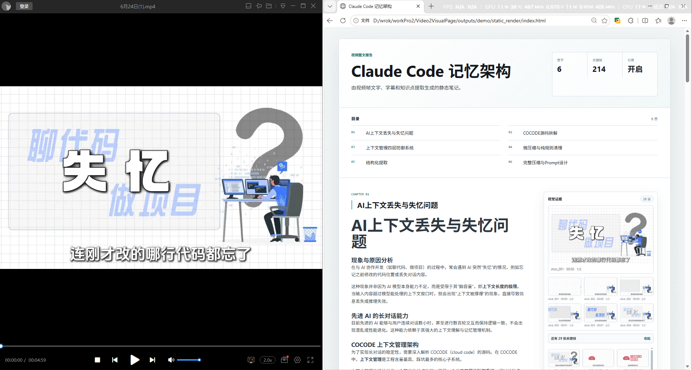
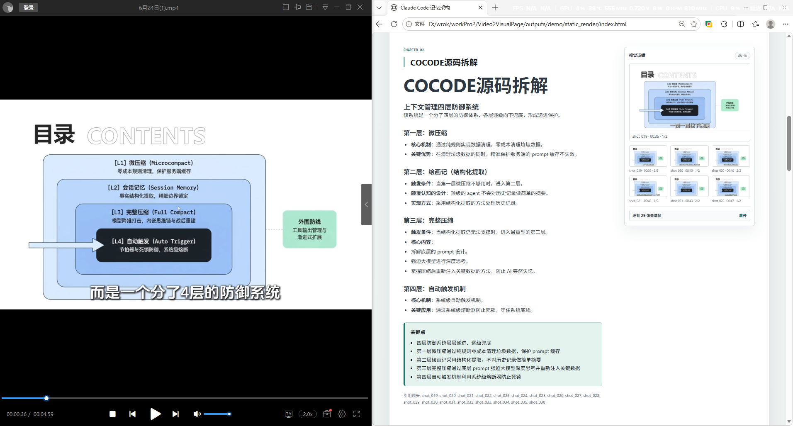
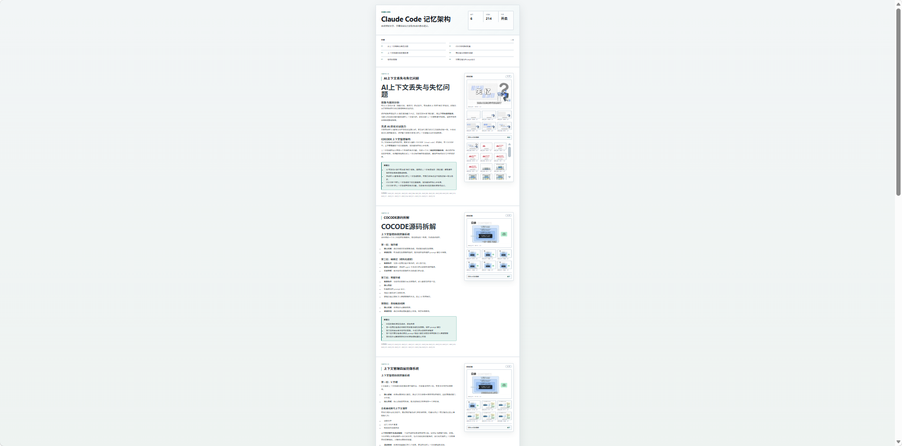

# Video2VisualPage

Video2VisualPage 是一个本地运行的视频转可视化网页报告工具。它会把一段视频拆解为媒体信息、镜头、字幕、关键帧、镜头理解、全局摘要、章节大纲和章节正文，最后渲染成可以直接打开的静态 HTML 报告。

项目采用纯文件流水线，不依赖数据库。每个步骤都会从 `outputs/{project_id}/{step_name}/` 读取上游产物，并把自己的 JSON、JSONL、图片、HTML 和日志写回磁盘，方便单步调试、断点续跑、结果追溯和后续二次生成。

适合的使用场景：

- 把课程、演示、访谈、技术讲解视频转换成图文结构化笔记。
- 为长视频生成章节目录、重点摘要、关键帧证据和可浏览报告。
- 在本地保留完整中间产物，便于复查模型输入输出和镜头引用。
- 基于同一批 JSON/JSONL 结果继续生成 HTML、PDF、PPT 或其他内容形态。

## 效果预览



左侧是原始视频播放画面，右侧是生成后的静态可视化报告：首页包含标题、摘要指标、目录和章节正文，并在侧栏保留关联镜头证据。



章节页会把模型生成的正文、关键点和引用镜头组织在同一个阅读视图中，方便从文字结论回看对应的视频关键帧。



最终产物是一个可直接打开的本地 HTML 页面，适合浏览、归档，也可以继续作为 PDF 或其他静态内容的生成来源。

## 核心流程

完整流程分为 12 个步骤：

1. 初始化项目目录和运行状态。
2. 探测视频时长、帧率、分辨率、音频等基础信息。
3. 使用 OpenCV 工具切分镜头并抽取关键帧。
4. 读取侧边字幕或调用在线 ASR，生成标准化字幕。
5. 按时间重叠把字幕对齐到镜头。
6. 构建模型可读的 `shot_packages.jsonl`。
7. 使用视觉模型理解单个镜头，生成结构化镜头卡片。
8. 对镜头卡片做分块摘要和全局摘要。
9. 规划报告目录，并把镜头分配到章节。
10. 按章节生成正文 JSON。
11. 渲染静态 HTML 报告。
12. 校验 JSON/JSONL、图片引用、章节内容和最终 HTML。

这个设计的核心是把“视频理解”拆成可复用的中间文件：镜头卡片、摘要、大纲和章节都可以单独检查、重跑或替换模型后重新生成。

## Install

```powershell
python -m pip install -e .
```

The bundled OpenCV shot splitter under `utils/opencv-shot-segmenter` is imported directly. Online ASR is enabled by default when no sidecar subtitles are found. Set this only when you want to force offline empty-subtitle fallback:

```powershell
$env:VIDEO2VISUALPAGE_ENABLE_ONLINE_ASR = "0"
```

## Model Configuration

Model settings are read from `.env` at runtime, so existing projects can switch from `local_heuristic` to real models without running `init` again. The supported remote provider is any OpenAI-compatible `/v1/chat/completions` endpoint.

There are two model roles:

- `vision_model`: used by `06_shot_understanding` for keyframe/image understanding.
- `copywriting_model`: used by `07_summary_reduce` and `09_chapter_write` for summaries and chapter prose.

```dotenv
VIDEO2VISUALPAGE_LLM_OUTPUT_LANGUAGE=zh-CN

VIDEO2VISUALPAGE_VISION_MODEL_PROVIDER=openai_compatible
VIDEO2VISUALPAGE_VISION_MODEL_BASE_URL=https://api.openai.com/v1
VIDEO2VISUALPAGE_VISION_MODEL_MODEL=your-vision-model
VIDEO2VISUALPAGE_VISION_MODEL_API_KEY=your-api-key

VIDEO2VISUALPAGE_COPYWRITING_MODEL_PROVIDER=openai_compatible
VIDEO2VISUALPAGE_COPYWRITING_MODEL_BASE_URL=https://api.openai.com/v1
VIDEO2VISUALPAGE_COPYWRITING_MODEL_MODEL=your-better-writing-model
VIDEO2VISUALPAGE_COPYWRITING_MODEL_API_KEY=your-api-key
```

Legacy `VIDEO2VISUALPAGE_LLM_*` variables are still supported as shared fallbacks. Keep `VIDEO2VISUALPAGE_LLM_PROVIDER=local_heuristic` only when you intentionally want the deterministic local placeholder.

## Progress Output

Commands print progress to `stderr` and keep the final JSON result on `stdout`. Model stages show the current item, percentage, provider/model, attempt number, input preview, elapsed time, and response key preview. Disable terminal progress when needed:

```powershell
$env:VIDEO2VISUALPAGE_PROGRESS = "0"
```

## Model I/O Monitoring

Every model call through `LocalModelAdapter` writes structured monitoring logs under `outputs/{project_id}/logs/llm_monitor/`. The monitor groups records by model function, keeps a global `index.jsonl`, writes per-call details, and maintains `health.json` for success rate, failures, retry/latency, and provider-call stability. See `docs/llm-monitoring.md` for the schema.

## Commands

Commands that operate on an existing project default to `outputs\demo`, so you can omit `--project` for the common local workflow.

Create a project and run the whole pipeline:

```powershell
python -m video2visualpage run .\utils\opencv-shot-segmenter\data\1.mp4 --project-name demo
```

Run only a numeric stage range:

```powershell
python -m video2visualpage run .\utils\opencv-shot-segmenter\data\1.mp4 --project-name demo --steps 1-5
```

Resume from the first incomplete stage:

```powershell
python -m video2visualpage resume
```

Run or rerun specific stages:

```powershell
python -m video2visualpage stage --stage subtitle_align
python -m video2visualpage rerun --from shot_understanding --to qa
python -m video2visualpage rerun --steps 6-11
python -m video2visualpage summary-reduce
python -m video2visualpage outline-plan
```

Run one step directly from a video. `--project-name demo` always writes `outputs\demo`; if that folder exists, it is overwritten. Missing upstream JSON steps are created automatically:

```powershell
python -m video2visualpage media-info --video .\utils\opencv-shot-segmenter\data\1.mp4 --project-name demo
python -m video2visualpage shot-split --video .\utils\opencv-shot-segmenter\data\1.mp4 --project-name demo
```

Render and QA:

```powershell
python -m video2visualpage render --format html
python -m video2visualpage qa --fix
```

## Steps

Each step owns one output folder and writes `step_manifest.json` plus its data artifacts:

- `init/`: create `project.json`, `config.json`, `run_state.json`, and logs.
- `media_info/`: probe duration, fps, dimensions, codec, and audio status.
- `shot_split/`: reuse the bundled OpenCV tool and write `shots.json` plus `normalized_shots.json`.
- `subtitle_extract/`: load sidecar subtitles or optionally call online ASR, with empty-subtitle fallback.
- `subtitle_align/`: align subtitles to shots by time overlap.
- `shot_package/`: write model-ready `shot_packages.jsonl`.
- `shot_understanding/`: generate isolated shot cards; `local_heuristic` is an explicit local adapter, and unimplemented model providers fail instead of falling back silently.
- `summary_reduce/`: chunk shot cards and write `global_summary.json`.
- `outline_plan/`: create chapters and assign valid shot references.
- `chapter_write/`: write per-chapter JSON; `write-chapter` can regenerate one chapter.
- `static_render/`: copy images, render `index.html`, and always write `render_result.json`.
- `qa/`: validate JSON/JSONL, contracts, references, images, chapter bodies, and final HTML.

The numbered stage IDs, such as `01_media_probe` and `02_shot_split`, still work as aliases for compatibility, but new outputs use the step folders above. Project folders use the sanitized project name directly, for example `outputs\demo`.

## Development

Run tests:

```powershell
python -m pytest -q
```

The test suite includes generated tiny-video tests for the full pipeline and direct step commands such as `shot-split --video ...`.
