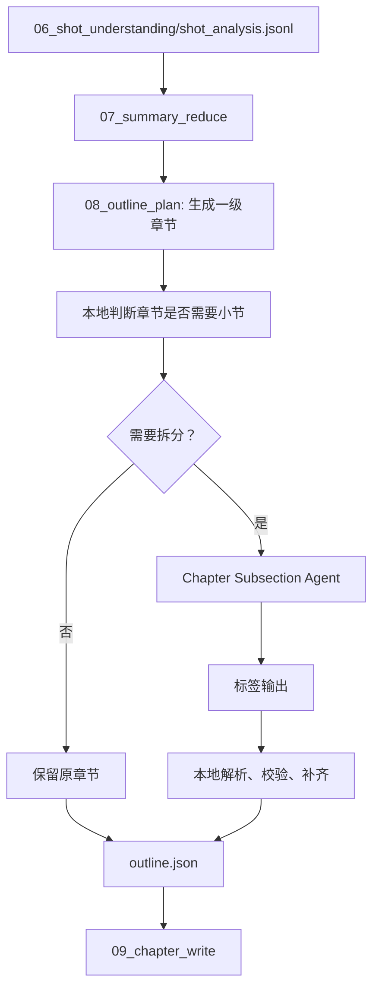

# Chapter Subsection Agent 设计文档

## 背景

当前链路中，`07_summary_reduce` 负责把镜头理解结果压缩为 chunk 摘要和全局摘要，`08_outline_plan` 负责生成一级章节，`09_chapter_write` 再按章节写正文。

现在的问题是：一级章节有时只是按镜头数量或全局 section 粗略分出来的“大章节”。如果直接把一个信息密度很高的大章节交给章节写作模型，模型容易写成一整段摘要，缺少内部层次；但如果所有章节都强行拆小节，又会把已经足够细的章节拆碎，导致目录噪音和额外模型成本。

因此需要在一级章节之后增加一个“章节内小节规划”逻辑：先判断当前章节是否需要进一步拆分；只有确实需要时，才调用大模型生成小节；如果章节已经足够细，就保持原样。

## 目标

- 为每个一级章节判断是否需要生成二级小节。
- 只对信息密度高、跨度长、主题变化明显的章节调用模型。
- 章节已经足够细时不调用模型，也不生成空洞小节。
- 模型输出使用标签结构，不要求模型直接输出 JSON。
- 控制模型输出长度，只让模型输出小节标题和镜头范围。
- 最终 JSON 由本地程序组装、校验和修复。
- 保持 `outline.json` 对下游兼容：没有 `subsections` 的章节仍按旧逻辑写作。

## 非目标

- 不重新生成一级章节。
- 不在这个 Agent 中写章节正文。
- 不让模型输出正文、摘要、key_points、warnings。
- 不让模型重新选择全局主题或章节标题。
- 不让模型直接决定最终 JSON 结构。
- 不把每个章节都交给模型做二次判断。

## 推荐位置

推荐把该逻辑作为 `08_outline_plan` 的后处理子流程：



这样做的好处是：

- 小节是目录结构的一部分，应该在写正文之前确定。
- `09_chapter_write` 可以根据 `chapter.subsections` 写出更稳定的 Markdown 层级。
- 对没有小节的章节，`09_chapter_write` 继续沿用当前行为。

## 输出契约

`outline.json` 的章节对象增加可选字段 `subsections`。没有该字段或字段为空时，表示不拆小节。

```json
{
  "chapter_id": "chapter_001",
  "title": "AI 上下文丢失与失忆问题",
  "summary": "本章解释上下文管理问题的背景和成因。",
  "shot_ids": ["shot_001", "shot_002", "shot_003"],
  "representative_shot_id": "shot_002",
  "subsections": [
    {
      "subsection_id": "chapter_001_sub_001",
      "title": "上下文丢失的表现",
      "shot_ids": ["shot_001", "shot_002"],
      "representative_shot_id": "shot_002",
      "start_sec": 0.0,
      "end_sec": 18.4
    }
  ]
}
```

为了便于调试，可以额外输出：

```txt
outputs/{project_id}/outline_plan/subsection_decisions.jsonl
```

每行记录一个章节的本地判断结果，例如：

```json
{
  "chapter_id": "chapter_001",
  "mode": "split",
  "need_score": 6,
  "reason_codes": ["many_shots", "topic_shift", "high_density"],
  "model_called": true,
  "subsection_count": 3
}
```

这个调试文件不参与正文生成，只用于 QA 和后续调参。

## 是否需要拆小节的判断

判断应尽量本地完成，避免对每个章节都调用模型。推荐使用“硬性跳过 + 打分触发”的两层策略。

### 硬性跳过

满足以下条件之一时，直接不拆，也不调用模型：

- 本章 `shot_count <= 4`。
- 本章 `duration_sec <= 90` 且有效 topic 数量 `<= 2`。
- 本章只有一个明显主题，且相邻镜头之间没有明显 topic shift。
- 本章标题已经具体，且 `summary` 能覆盖全部镜头内容。
- 本章拆分后预计每个小节不足 2 个镜头。

这些章节继续作为单个章节交给 `09_chapter_write`。

### 打分触发

其余章节计算 `need_score`。推荐初始规则：

| 信号 | 加分 | 说明 |
| --- | ---: | --- |
| `shot_count >= 8` | +2 | 镜头数量较多，正文容易变成大段摘要 |
| `shot_count >= 14` | +1 | 非常长的章节额外加分 |
| `duration_sec >= 180` | +1 | 时间跨度较长 |
| `duration_sec >= 360` | +1 | 超长章节额外加分 |
| 有效 topic 数量 `>= 3` | +2 | 章节内可能存在多个知识点 |
| 有效 topic 数量 `>= 5` | +1 | 主题更分散 |
| 明显 topic shift 数量 `>= 2` | +2 | 相邻镜头组发生内容转向 |
| 高重要度镜头分布在多个片段 | +1 | 多个重点簇适合拆成多个小节 |
| 章节标题过泛 | +1 | 例如“内容概览”“总结”“结构化提取” |

建议阈值：

```txt
need_score >= 5: 调用模型生成小节
need_score <= 3: 不拆小节
need_score == 4: 默认不拆；如果 chapter_count 很少或本章占全片镜头超过 25%，再调用模型
```

### topic shift 的本地计算

不需要引入复杂模型，可以用轻量规则：

1. 为每个镜头构造 topic set：
   - `topic_tags`
   - `key_entities`
   - `narrative_role`
   - `merged_summary` 中提取的短关键词，第一版可不做
2. 用相邻滑窗比较主题变化，例如前 3 个镜头和后 3 个镜头。
3. 如果两个窗口的 Jaccard 相似度低于阈值，比如 `0.25`，记为一次 topic shift。
4. 相邻 shift 距离很近时合并，避免噪音。

这个结果只用于决定是否调用模型，不直接作为最终小节边界。

## 小节数量建议

调用模型前，本地计算一个建议小节数范围，作为 prompt 约束：

```txt
min_subsections = 2
max_subsections = min(5, ceil(shot_count / 4))
target_subsections = clamp(topic_shift_count + 1, 2, max_subsections)
```

原则：

- 一个一级章节最多 5 个小节。
- 每个小节默认至少 2 个镜头。
- 不为了凑数量强行拆分。
- 如果模型只能找到 1 个有效小节，则本地丢弃小节结果，保持原章节。

## 模型输入设计

模型只接收当前章节的轻量信息，不接收完整镜头卡片。

推荐输入：

```txt
<CHAPTER id="chapter_001" title="AI 上下文丢失与失忆问题" shots="18" target="3" max="5">
SUMMARY: 本章解释上下文管理问题的背景、源码入口和后续防御机制。
</CHAPTER>

<SHOT id="shot_001" t="0.0-8.2" imp="0.74">
TAGS: 上下文; 失忆; 问题背景
TEXT: 引出 AI 协作中上下文丢失的问题。
</SHOT>

<SHOT id="shot_002" t="8.2-15.6" imp="0.81">
TAGS: 源码入口; COCODE
TEXT: 说明从源码入口开始分析上下文管理。
</SHOT>
```

输入字段控制：

| 字段 | 是否输入 | 原因 |
| --- | --- | --- |
| `shot_id` | 是 | 小节必须绑定真实镜头 |
| `start_sec/end_sec` | 是 | 帮助模型理解时间顺序 |
| `importance_score` | 是 | 帮助模型识别关键片段 |
| `merged_summary` | 是，截断 | 主要语义来源 |
| `topic_tags` | 是，最多 5 个 | 帮助判断主题边界 |
| `key_entities` | 可选，最多 5 个 | 技术讲解类视频有价值 |
| OCR 原文长列表 | 否 | 噪音大，消耗上下文 |
| frames/path | 否 | 小节规划不需要图片 |
| warnings | 否 | 不参与结构判断 |
| full global_summary | 否 | 只传必要主题和章节摘要 |

`TEXT` 建议截断到 60 到 90 个中文字符。模型输出能力有限，输入也应尽量干净。

## 模型输出协议

不要让模型输出 JSON。使用扁平标签结构。

如果模型认为不应该拆，输出：

```txt
<KEEP/>
```

如果需要拆，输出：

```txt
<SUB shots="shot_001-shot_006">上下文丢失的表现</SUB>
<SUB shots="shot_007-shot_012">源码中的上下文入口</SUB>
<SUB shots="shot_013-shot_018">防御机制与压缩策略</SUB>
```

输出约束：

- 只允许输出 `<KEEP/>` 或 `<SUB>` 标签。
- 不输出 JSON。
- 不输出 Markdown。
- 不输出解释。
- 不输出小节摘要。
- 不输出 key points。
- 不输出每个小节的完整镜头明细，优先使用连续范围。
- `SUB` 数量为 2 到 5 个。
- `SUB` 标题不超过 24 个中文字符。
- `shots` 必须来自当前章节的 `shot_ids`。
- 小节应按视频时间顺序排列。

为什么只输出这些：

- 小节标题需要模型做语义归纳。
- 小节边界需要模型结合语义判断。
- `subsection_id`、`representative_shot_id`、`start_sec`、`end_sec` 都可以本地稳定补齐。
- 摘要和正文属于 `09_chapter_write`，不应该在这里提前生成。

## Prompt 重点

系统提示建议强调：

```txt
你是 Chapter Subsection Agent。
你的任务是判断当前一级章节内部是否需要二级小节，并在需要时输出小节标题和镜头范围。
不要输出 JSON。
不要写正文。
不要写解释。
如果章节已经足够细，只输出 <KEEP/>。
如果拆分，请只输出 <SUB shots="shot_001-shot_006">小节标题</SUB>。
```

用户提示建议强调：

```txt
输入镜头按视频时间顺序排列。
小节必须连续覆盖章节内的主要镜头。
不要为了凑数量拆分。
不要把同一主题拆成多个小节。
不要把没有明确主题变化的短章节拆开。
```

## 本地解析与校验

模型输出不能直接落盘，必须经过本地解析和校验。

### 解析规则

- 如果存在 `<KEEP/>`，并且没有有效 `<SUB>`，则保持章节不拆。
- 提取所有 `<SUB shots="...">title</SUB>`。
- `shots` 支持两种形式：
  - `shot_001-shot_006`
  - `shot_001,shot_002,shot_003`
- 范围展开必须基于当前章节内的 `shot_ids` 顺序。
- 不存在的 `shot_id` 直接移除，并记录 warning。

### 校验规则

- 小节数量少于 2：丢弃小节，保持原章节。
- 小节数量超过 5：只保留前 5 个，或合并尾部相邻小节。
- 小节标题为空：删除该小节。
- 小节标题重复：合并相邻重复小节。
- 小节没有有效镜头：删除该小节。
- 小节之间有重叠：按输出顺序保留第一次归属。
- 小节之间有缺口：把缺口镜头并入最近的前后小节。
- 小节平均镜头数小于 2 且不是重要单镜头：丢弃小节结果。

### 本地补齐

本地为每个有效小节补齐：

- `subsection_id`
- `shot_ids`
- `representative_shot_id`
- `start_sec`
- `end_sec`

`representative_shot_id` 选择小节内 `importance_score` 最高的镜头，不让模型选择。

## 降级策略

以下情况不让阶段失败，直接保持原章节：

- 模型调用失败。
- 模型输出无法解析。
- 模型输出 JSON 或解释性文本，但没有有效 `<SUB>`。
- 有效小节少于 2 个。
- 校验后小节覆盖太少，例如覆盖本章镜头少于 60%。
- 小节标题全部是泛化标题，例如“介绍”“总结”“内容概览”。

降级时：

- `outline.json` 中不写 `subsections`。
- `subsection_decisions.jsonl` 记录 `mode: "keep_fallback"`。
- `warnings` 中记录简短原因。

## 对 chapter_write 的影响

`09_chapter_write` 读取章节时：

- 如果没有 `subsections`：按当前方式写整章正文。
- 如果有 `subsections`：prompt 中传入小节列表，要求正文按小节顺序组织。

建议章节正文仍然只输出一个 `chapter_*.json`，不要把每个小节变成独立文件。原因：

- 一级章节仍是页面导航和章节索引单位。
- 小节是正文内部层级，适合渲染成 Markdown 的 `##`。
- 保持 `chapters_index.json` 简单，不破坏现有渲染链路。

章节写作模型可以根据 `subsections` 生成：

```md
## 上下文丢失的表现

...

## 源码中的上下文入口

...
```

如果未来要进一步降低 JSON 输出不稳定性，可以把 `chapter_writer_prompt` 也改为标签输出，再由本地组装 `chapter_*.json`。但这不是本设计的第一优先级。

## 与一级章节的边界

小节不是用来修复明显错误的一级章节。

如果一个章节横跨多个全局主题，且每个主题都足够独立，长期看应该回到 `08_outline_plan` 重新规划一级章节。小节规划只处理这种情况：

- 一级章节主题仍然成立。
- 章节内部存在 2 到 5 个自然层次。
- 这些层次适合作为正文中的二级标题，而不是页面级章节。

判断口诀：

```txt
能成为页面目录的一章：一级章节
只能帮助读者读顺当前章：二级小节
```

## 配置建议

新增配置可以放在 `config.llm` 或单独的 `outline` 配置下：

```json
{
  "chapter_subsections": {
    "enabled": true,
    "min_shots_for_model": 8,
    "min_need_score": 5,
    "max_subsections_per_chapter": 5,
    "min_shots_per_subsection": 2,
    "model_keep_allowed": true
  }
}
```

默认建议开启，但由于有本地硬性跳过和打分阈值，不会导致所有章节都调用模型。

## 测试建议

单测：

- `shot_count <= 4` 的章节不会调用模型。
- topic 单一的长章节默认不拆或低分。
- 多 topic、多 shift 的章节会触发模型调用。
- `<KEEP/>` 输出会保持原章节。
- 标准 `<SUB>` 输出能生成 `subsections`。
- 非法 shot id 会被过滤。
- 小节少于 2 个时回退为不拆。
- 小节有缺口时会被本地补齐。
- 重复标题会被合并或去重。
- 模型输出 JSON 时不会污染最终 `outline.json`。

集成测试：

- 短视频：不生成小节。
- 普通技术讲解：只对少数大章节生成小节。
- 长视频：多个大章节可生成 2 到 5 个小节。
- 模型失败：pipeline 继续运行，章节写作仍可完成。

## 落地顺序建议

1. 在 `docs/stages/08_outline_plan/README.md` 中补充可选 `subsections` 契约。
2. 新增本地章节拆分评分器和决策记录。
3. 新增 `chapter_subsection_prompt.txt`，使用标签输出协议。
4. 新增标签解析和校验逻辑。
5. 在 `08_outline_plan` 生成一级章节后运行小节规划后处理。
6. 更新 `chapter_write` prompt，使其在有 `subsections` 时按小节写 Markdown。
7. 补充单测和集成测试。

第一版实现可以只做：

- 本地判断是否调用模型。
- 模型输出 `<KEEP/>` 或 `<SUB>`。
- `outline.json` 增加可选 `subsections`。
- `chapter_write` 消费 `subsections`。

这样改动面比较小，也能先验证“小节规划是否真的提升正文结构”。
