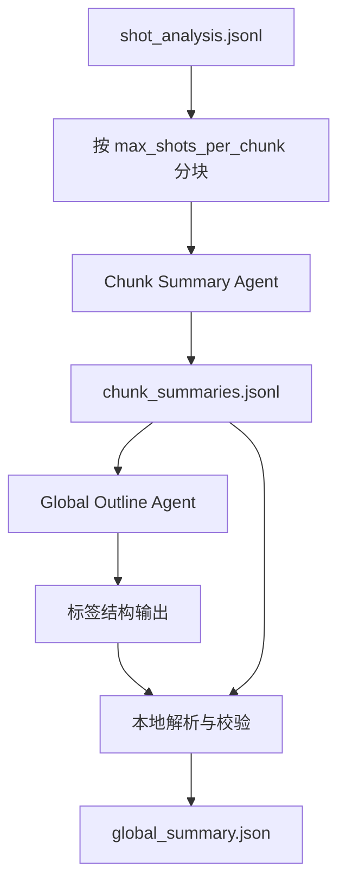

# Global Outline Agent 设计文档

## 背景

当前 `07_summary_reduce` 生成 `global_summary.json` 时，`main_sections` 的逻辑过于简单：

1. 顺序收集所有 chunk 的 `main_topics`。
2. 做字符串级去重。
3. 取前 6 个作为 `main_sections`。

这个逻辑不会理解主题之间的包含、重复、层级和转折关系。例如 `"Prompt 缓存机制"`、`"缓存保护"`、`"清理旧数据与保留缓存"` 可能属于同一个章节方向，但当前实现会把它们当成多个并列 section。

因此需要引入一个独立的 Global Outline Agent，让大模型基于所有 chunk 摘要重新生成全局大纲，再由本地程序解析、校验并组装为 `global_summary.json`。

## 目标

- 用独立 Agent 生成更合理的 `main_sections`。
- 让模型做语义归并、主题重命名和全局结构判断。
- 避免模型直接输出复杂 JSON。
- 控制模型输出长度，只让模型输出必要信息。
- 保持现有 `global_summary.json` 对下游阶段兼容。
- 保留可降级的规则聚合逻辑，避免模型失败导致阶段不可用。

## 非目标

- 不在这个 Agent 里分配最终章节的 `shot_ids`。
- 不在这个 Agent 里写章节正文。
- 不要求模型输出每个 section 的长摘要。
- 不让模型重新选择全局 `important_shots`。
- 不让模型直接产出最终 JSON 文件。

## 新流程



和当前流程相比，变化点只在 `chunk_summaries.jsonl` 到 `global_summary.json` 之间：

- 旧逻辑：直接拼 `main_topics`。
- 新逻辑：把 chunk 摘要交给 Global Outline Agent，让模型输出全局主题和 section 标题。

## Agent 输入设计

Global Outline Agent 不读取完整镜头卡片，只读取 `chunk_summaries.jsonl` 的压缩结果。

推荐输入字段：

```txt
chunk_id
shot_range
main_topics
summary
```

不推荐输入字段：

```txt
important_shots
warnings
topic_tags
逐镜头 merged_summary
关键帧路径
OCR 原文长列表
```

原因：

- `main_sections` 的生成主要依赖主题和摘要，不需要镜头级细节。
- `important_shots` 可以由本地程序继续从 chunk 摘要聚合，不需要模型重选。
- 减少输入噪声能提高模型对全局结构的判断稳定性。

推荐组装成轻量文本，而不是大 JSON：

```txt
<CHUNK id="chunk_001" range="shot_001-shot_040">
TOPICS: AI上下文丢失; COCODE源码拆解; 四层防御系统
SUMMARY: 本段解释 AI 协作中上下文丢失的根因，并引出源码中的上下文管理机制。
</CHUNK>

<CHUNK id="chunk_002" range="shot_041-shot_080">
TOPICS: Prompt缓存; 旧数据清理; 双轨决策机制
SUMMARY: 本段讨论缓存保护与上下文清理之间的冲突，以及服务端缓存存活时的精细清理策略。
</CHUNK>
```

输入压缩规则：

- `TOPICS` 最多保留每个 chunk 前 5 个。
- `SUMMARY` 建议截断到 180 到 260 个中文字符。
- `chunk_id` 必须保留原值。
- `shot_range` 原样传入，仅用于模型理解时间顺序。
- chunk 顺序必须保持视频时间线顺序。

## Agent 输出协议

模型不要输出 JSON，改用简单标签结构。

最小输出格式：

```txt
<THEME>AI上下文管理与记忆压缩机制</THEME>
<STYLE>structured_report</STYLE>
<SECTION chunks="chunk_001">问题背景：上下文丢失与源码入口</SECTION>
<SECTION chunks="chunk_001,chunk_002">四层压缩与缓存保护机制</SECTION>
<SECTION chunks="chunk_002,chunk_003">工具输出清理与线程隔离</SECTION>
<SECTION chunks="chunk_003">更深层的记忆压缩策略</SECTION>
```

字段含义：

| 标签 | 必填 | 说明 |
| --- | --- | --- |
| `THEME` | 是 | 视频主主题，一句话短标题 |
| `STYLE` | 否 | 叙述风格；缺失时本地默认 `structured_report` |
| `SECTION` | 是 | 一个全局 section；文本内容是 section 标题 |
| `chunks` | 建议 | 该 section 主要来自哪些 chunk |

模型只需要输出这些内容，不输出：

- section 摘要
- shot 列表
- warnings
- suggested chapter count
- JSON 外壳
- Markdown 标题
- 解释性文字

## Prompt 约束建议

系统提示重点：

```txt
你是 Global Outline Agent。你的任务是根据分块摘要生成视频级大纲。
你必须合并重复主题，按视频时间顺序组织 section。
不要逐条复述 chunk topics。
不要输出 JSON。
只输出指定标签。
```

用户提示重点：

```txt
输入是按时间顺序排列的 chunk 摘要。
请输出 3 到 6 个 SECTION；短视频可以少于 3 个。
每个 SECTION 标题必须是对多个 topic 的归纳，而不是照抄单个 topic。
如果一个主题跨多个 chunk，请把多个 chunk_id 写入 chunks 属性。
```

输出限制：

```txt
THEME 不超过 24 个中文字符。
SECTION 标题不超过 28 个中文字符。
SECTION 数量最多 6 个。
除 THEME、STYLE、SECTION 标签外，不要输出任何内容。
```

## 本地解析逻辑

解析器只处理简单、扁平的标签，不处理嵌套结构。

解析步骤：

1. 提取第一个 `<THEME>...</THEME>`。
2. 提取第一个 `<STYLE>...</STYLE>`，没有则使用默认值。
3. 按出现顺序提取所有 `<SECTION chunks="...">...</SECTION>`。
4. 对 `SECTION` 的文本做 trim。
5. 对 `chunks` 按逗号拆分，并过滤不存在的 `chunk_id`。
6. 删除空标题 section。
7. 对重复标题做顺序去重。
8. 如果 section 数量超过上限，保留前 6 个或按相邻 chunk 合并。
9. 如果没有任何有效 section，进入降级逻辑。

标题去重建议使用轻量归一化：

- 去掉首尾空白。
- 去掉连续空格。
- 去掉常见序号前缀，如 `一、`、`1.`、`第1部分`。
- 不做复杂语义去重，语义归并交给模型完成。

## 校验与修正逻辑

### chunk 引用校验

- `chunks` 中不存在的 chunk id 直接移除。
- 如果某个 section 没有有效 chunk，但标题有效，可以保留标题，并写 warning。
- `global_summary.source_chunks` 始终由本地程序写入所有输入 chunk id，不依赖模型。

### 时间顺序校验

section 输出顺序应以模型顺序为准，但需要检查 chunk 顺序是否明显倒置。

推荐策略：

- 每个 section 计算 `first_chunk_index`。
- 如果 section 顺序和 `first_chunk_index` 大幅冲突，按 `first_chunk_index` 重新排序。
- 如果 section 没有有效 chunks，则保持原相对位置。

### section 数量校验

建议默认范围：

```txt
min_sections = 1
max_sections = 6
preferred_sections = 3-6
```

处理策略：

- 0 个 section：降级到规则聚合。
- 1 到 6 个 section：直接使用。
- 超过 6 个 section：优先合并相邻且来源 chunk 重叠的 section；无法合并时截断到 6 个，并写 warning。

### 标题质量校验

需要过滤明显无效标题：

- 空字符串。
- 纯数字。
- 纯标点。
- `"总结"`、`"内容概览"`、`"重点回顾"` 这类占位词。
- 和 `THEME` 完全相同且只有一个 section 以外的重复标题。

如果过滤后 section 太少，可以从 chunk `main_topics` 中补齐，但补齐逻辑只作为降级。

## global_summary.json 组装

模型标签输出不直接落盘。最终 JSON 由本地程序组装。

推荐结构：

```json
{
  "video_main_theme": "AI上下文管理与记忆压缩机制",
  "main_sections": [
    "问题背景：上下文丢失与源码入口",
    "四层压缩与缓存保护机制",
    "工具输出清理与线程隔离",
    "更深层的记忆压缩策略"
  ],
  "suggested_chapter_count": 4,
  "narrative_style": "structured_report",
  "important_shots": ["shot_003", "shot_006", "shot_041"],
  "source_chunks": ["chunk_001", "chunk_002", "chunk_003"],
  "section_sources": [
    {
      "title": "问题背景：上下文丢失与源码入口",
      "source_chunks": ["chunk_001"]
    },
    {
      "title": "四层压缩与缓存保护机制",
      "source_chunks": ["chunk_001", "chunk_002"]
    }
  ],
  "warnings": []
}
```

字段来源：

| 字段 | 来源 |
| --- | --- |
| `video_main_theme` | Agent 的 `THEME` |
| `main_sections` | Agent 的 `SECTION` 标题 |
| `suggested_chapter_count` | 有效 section 数量，经过上下限修正 |
| `narrative_style` | Agent 的 `STYLE` 或默认值 |
| `important_shots` | 本地从所有 chunk 的 `important_shots` 顺序去重后截断 |
| `source_chunks` | 本地从所有 chunk 摘要收集 |
| `section_sources` | Agent 的 `SECTION chunks` 解析结果 |
| `warnings` | 本地校验和降级过程生成 |

兼容性说明：

- 保留现有必需字段：`video_main_theme`、`main_sections`、`suggested_chapter_count`、`narrative_style`、`important_shots`。
- 新增字段 `source_chunks`、`section_sources`、`warnings` 不应破坏下游读取。
- 如果下游暂时不用 `section_sources`，也可以先写入，作为调试和未来目录规划的依据。

## suggested_chapter_count 设计

新逻辑建议以 Agent 输出的有效 section 数量为主：

```txt
suggested_chapter_count = len(valid_sections)
```

再进行边界修正：

```txt
suggested_chapter_count >= 1
suggested_chapter_count <= 6
suggested_chapter_count <= shot_count
```

如果配置里显式指定 `chapter_count`，后续 `08_outline_plan` 仍可覆盖这个建议值。

如果 Agent 失败并进入降级逻辑，则沿用当前 `_suggested_chapter_count` 的规则算法。

## important_shots 设计

Global Outline Agent 不输出 `important_shots`。

继续使用本地聚合：

1. 按 chunk 顺序收集每个 chunk 的 `important_shots`。
2. 按第一次出现顺序去重。
3. 最多保留 20 个。
4. 可选：校验这些 shot 是否存在于 `shot_analysis.jsonl`。

原因：

- 模型容易编造 shot id。
- chunk 摘要阶段已经有重要镜头判断。
- 全局大纲的主要目标是优化主题结构，不是重新做镜头选择。

## 降级逻辑

以下情况触发降级：

- 模型调用失败。
- 输出中没有 `THEME`。
- 输出中没有有效 `SECTION`。
- 标签结构无法解析。
- 有效 section 全部被质量校验过滤。

降级策略：

1. 使用当前规则聚合逻辑生成 `unique_topics`。
2. 过滤占位 topic。
3. 取前 6 个作为 `main_sections`。
4. `warnings` 写入 `global_outline_agent_failed` 或具体错误原因。

这样可以保证 `07_summary_reduce` 不因为全局大纲 Agent 失败而整体失败。

## 长视频扩展策略

第一版可以直接把所有 chunk 摘要输入 Global Outline Agent。

当 chunk 数量很大时，建议增加两级策略：

```txt
chunk_summaries
  -> 每 20 个 chunk 生成 group outline
  -> Global Outline Agent 合并 group outline
```

group outline 也使用同一套标签协议，只是 `SECTION chunks` 可以覆盖一个 chunk 范围。

触发条件建议：

```txt
chunk_count <= 30: 单次 Global Outline Agent
chunk_count > 30: group outline + global merge
```

这个扩展不是第一版必须实现，但协议应提前兼容。

## 测试建议

单测：

- 模型输出标准标签时能生成正确 `global_summary.json`。
- 模型输出额外解释文字时，解析器仍能提取有效标签。
- `SECTION chunks` 引用不存在 chunk 时会被过滤并写 warning。
- 重复 section 标题会被去重。
- 无 `STYLE` 时默认 `structured_report`。
- 无有效 `SECTION` 时走规则降级。
- 超过 6 个 section 时会截断或合并。
- `important_shots` 不依赖模型输出，仍从 chunk 摘要聚合。

集成测试：

- 使用 1 个 chunk 的短视频。
- 使用 3 个 chunk 的普通视频。
- 使用 30 个以上 chunk 的长视频。
- 使用重复 topic 很多的技术讲解视频。
- 使用 topic 很分散的混合内容视频。

## 推荐落地顺序

1. 新增 Global Outline Agent 的提示词和 adapter 方法。
2. 新增标签解析器和校验器。
3. 在 `run_summary_reduce` 中替换 `main_sections` 生成逻辑。
4. 保留旧规则聚合作为 fallback。
5. 更新 `docs/stages/07_summary_reduce/README.md` 的输出契约。
6. 为解析、校验、fallback 补单测。

