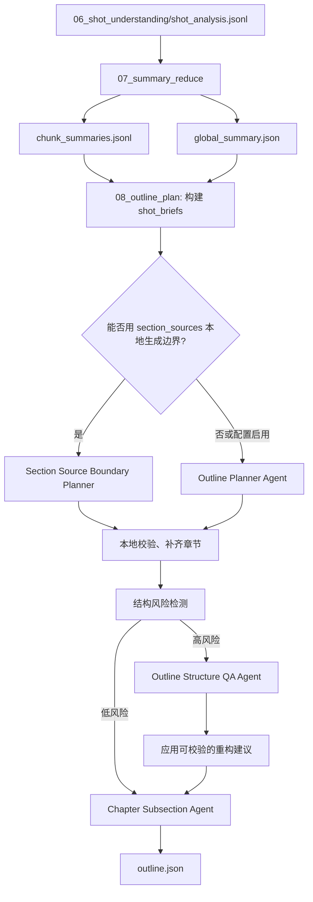

# Outline Planning Refactor 设计文档

## 背景

当前 `08_outline_plan` 的一级章节生成逻辑主要依赖 `global_summary.main_sections` 的数量，然后把全部镜头按数量均分到章节：

```txt
count = desired_chapter_count
per_chapter = ceil(total_shots / count)
chapter_001 = shots[0:per_chapter]
chapter_002 = shots[per_chapter:2 * per_chapter]
```

这种方式在短视频或主题变化均匀的视频上勉强可用，但在技术讲解、源码解析、长视频里容易出现结构错位：

- 一级章节不是语义边界，而是平均分出来的大盒子。
- 二级小节反而更像真实目录。
- 同一个知识点可能同时出现在某一章的小节和下一章的一级标题里。
- 上游 `global_summary.section_sources` 已经给出 section 与 chunk 的关系，但 `08_outline_plan` 没有使用。

示例问题：

```txt
chapter_001: 上下文丢失痛点与四层防御架构概览
  sub_005: 第一层防御详解：白名单与缓存优化

chapter_002: 第一层微压缩机制：规则清理与缓存保护
```

这里 `第一层微压缩` 被拆在两个一级章节之间，说明一级章节边界已经不准。`Chapter Subsection Agent` 只能在错误的大章节内部补救，不能修复一级目录规划错误。

## 目标

- 让一级章节先按语义边界切分，而不是按镜头数量均分。
- 优先复用 `07_summary_reduce` 已生成的 `section_sources` 和 `chunk_summaries`。
- 引入全局 `Outline Planner Agent`，一次性理解全局目录结构、章节层级和镜头范围。
- 保留可降级的本地规则，避免模型失败导致阶段不可用。
- 明确一级章节和二级小节的职责边界。
- 增加目录结构 QA，只在高风险结构下触发模型复核。
- 保持 `outline.json` 对 `09_chapter_write` 和 `10_static_render` 的兼容。

## 非目标

- 不在本改造里重写章节正文生成逻辑。
- 不让模型直接写最终完整 `outline.json`。
- 不把所有目录问题都交给事后 QA agent 兜底。
- 不要求 `07_summary_reduce` 输出镜头级章节分配。
- 不移除现有 `Chapter Subsection Agent`，而是重新定义它只处理章节内部层级。

## 总体结论

需要全局梳理目录结构，但主流程不应是“先生成一个可能错的目录，再用 agent 审一遍”。

推荐分三层改造：

1. **短期修复**：`08_outline_plan` 使用 `section_sources + chunk_summaries.shot_range` 生成一级章节边界，替代纯均分。
2. **中期主方案**：新增 `Outline Planner Agent`，基于 `global_summary + chunk_summaries + shot_briefs` 一次性规划一级章节。
3. **长期兜底**：新增 `Outline Structure QA Agent`，只在检测到结构异常时判断章节与小节是否需要升降级或重切。

## 目标流程



## 一级章节与二级小节边界

一级章节用于页面级目录导航，应该满足：

- 可以独立成为报告中的一大章。
- 有相对完整的主题目标。
- 通常覆盖一个或多个连续 chunk。
- 标题回答“这一章讲什么核心问题”。

二级小节用于帮助读者读顺当前章，应该满足：

- 只解释当前一级章节内部的自然层次。
- 不应该和其他一级章节标题语义重复。
- 不承担修复一级章节边界错误的职责。
- 标题回答“这一章内部按什么顺序展开”。

判断口诀：

```txt
能成为页面目录的一章：一级章节
只能帮助读者读顺当前章：二级小节
```

## 短期方案：使用 section_sources 生成边界

### 输入

```txt
summary_reduce/global_summary.json
summary_reduce/chunk_summaries.jsonl
shot_understanding/shot_analysis.jsonl
```

关键字段：

```json
{
  "main_sections": ["问题背景", "第一层微压缩"],
  "section_sources": [
    {"title": "问题背景", "source_chunks": ["chunk_001"]},
    {"title": "第一层微压缩", "source_chunks": ["chunk_002", "chunk_003"]}
  ]
}
```

`chunk_summaries.jsonl` 中需要读取：

```json
{
  "chunk_id": "chunk_001",
  "shot_range": ["shot_001", "shot_036"]
}
```

历史产物里 `shot_range` 可能是字符串，例如：

```txt
shot_001 - shot_036
200.0 - 299.067
```

因此本地解析必须兼容两类格式：

- `shot_id` 范围：直接映射到镜头序列。
- 时间范围：用 `start_sec/end_sec` 选择覆盖镜头。

### 生成规则

1. 按 `global_summary.main_sections` 的顺序创建章节。
2. 对每个 section 查找同名 `section_sources`。
3. 根据 `source_chunks` 找到对应 chunk 的 shot 范围。
4. 将这些 chunk 覆盖的镜头作为该章节候选 `shot_ids`。
5. 对相邻章节边界做去重和连续性修正。
6. 未被覆盖的镜头并入最近的相邻章节。
7. 多个 section 引用同一 chunk 时，使用 chunk 内的 shot_briefs 再切分，或回退到 `Outline Planner Agent`。

### 降级规则

满足以下任一情况时，不使用纯 `section_sources` 方案：

- `section_sources` 为空。
- 大多数 section 没有有效 `source_chunks`。
- 多个 section 大量引用同一组 chunk，无法唯一映射边界。
- chunk 的 `shot_range` 无法解析。
- 生成后某个章节没有镜头。
- 生成后某个章节覆盖镜头数超过全片 60%，且还存在多个 section。

降级时进入 `Outline Planner Agent`。如果模型也失败，再使用当前均分策略作为最后兜底，并写入 warning。

### 输出 warning 建议

```txt
outline_used_section_sources
outline_section_sources_missing
outline_chunk_range_unparseable:chunk_003
outline_section_sources_ambiguous
outline_fallback_even_split
```

## 中期方案：Outline Planner Agent

### 职责

`Outline Planner Agent` 负责生成一级章节结构：

- 判断哪些主题应该成为一级章节。
- 判断哪些主题只适合作为章节内部小节。
- 为每个一级章节输出标题、简短摘要和连续镜头范围。
- 尽量覆盖全片主要镜头。

它不负责：

- 写章节正文。
- 输出最终 JSON。
- 生成二级小节。
- 选择 `representative_shot_id`。
- 处理图片或渲染字段。

### 触发策略

默认建议：

```json
{
  "outline_planner": {
    "enabled": true,
    "prefer_section_sources": true,
    "call_model_when_ambiguous": true,
    "max_chapters": 8,
    "min_shots_per_chapter": 2
  }
}
```

触发模型的场景：

- `section_sources` 无法生成可靠章节。
- `section_sources` 显示多个 section 共用同一个 chunk。
- 全片镜头数较多且 `suggested_chapter_count <= 2`。
- 本地生成的章节内 `topic_shift_count` 很高。
- 小节标题与其他一级章节标题高度重复。
- 用户显式配置 `outline_planner.force_model = true`。

### 输入材料

推荐传入轻量结构，不传完整镜头卡片：

```json
{
  "global_summary": {
    "video_main_theme": "AI上下文管理与压缩机制",
    "main_sections": [],
    "section_sources": [],
    "important_shots": []
  },
  "chunk_summaries": [
    {
      "chunk_id": "chunk_001",
      "shot_range": ["shot_001", "shot_036"],
      "main_topics": ["上下文丢失", "四层防御"],
      "summary": "本段解释上下文丢失问题，并概览四层防御机制。"
    }
  ],
  "shot_briefs": [
    {
      "shot_id": "shot_001",
      "start_sec": 0.0,
      "end_sec": 3.2,
      "text": "引出 AI 协作中的上下文丢失问题。",
      "topic_tags": ["上下文丢失", "问题背景"],
      "importance_score": 0.75
    }
  ]
}
```

输入压缩规则：

- `chunk.summary` 截断到 220 到 280 个中文字符。
- `shot_briefs.text` 截断到 60 到 90 个中文字符。
- `topic_tags` 最多 5 个。
- `key_entities` 可选，最多 5 个。
- 不传关键帧路径、OCR 长文本、warnings、完整字幕原文。

### 输出协议

不要让模型输出 JSON。使用标签结构：

```txt
<TITLE>AI上下文管理机制拆解</TITLE>
<DESCRIPTION>从上下文丢失问题出发，拆解 COCODE 的多层压缩与缓存保护机制。</DESCRIPTION>
<CHAPTER shots="shot_001-shot_036">上下文丢失与四层防御总览</CHAPTER>
<SUMMARY>解释上下文容量被撑爆的原因，并概览四层防御架构。</SUMMARY>
<CHAPTER shots="shot_037-shot_072">第一层微压缩与缓存保护</CHAPTER>
<SUMMARY>说明规则清理、白名单、双轨决策和 prompt 缓存保护。</SUMMARY>
<CHAPTER shots="shot_073-shot_107">线程隔离与本地压缩优化</CHAPTER>
<SUMMARY>说明缓存过期后的本地轻量压缩、主线程隔离和算力优化。</SUMMARY>
```

约束：

- 只允许输出 `TITLE`、`DESCRIPTION`、`CHAPTER`、`SUMMARY` 标签。
- `CHAPTER` 必须按视频时间顺序排列。
- `CHAPTER shots` 优先使用连续范围。
- 章节数量 1 到 8 个。
- 标题不超过 28 个中文字符。
- 摘要不超过 80 个中文字符。
- 不输出二级小节。
- 不输出解释性文字。

### 本地解析

解析步骤：

1. 提取第一个 `TITLE`，缺失时使用默认标题。
2. 提取第一个 `DESCRIPTION`，缺失时使用默认描述。
3. 依序提取 `CHAPTER`。
4. 每个 `CHAPTER` 后面的第一个 `SUMMARY` 作为该章摘要。
5. 展开 `shots` 范围或列表。
6. 删除空标题、空镜头章节。
7. 合并相邻重复标题章节。
8. 按章节内首个镜头顺序排序。

### 本地校验与修复

必须由本地程序组装最终 `outline.json`：

- `chapter_id` 本地生成。
- `representative_shot_id` 选择章节内最高 `importance_score`。
- `start_sec/end_sec` 根据镜头时间补齐。
- `shot_ids` 必须来自 `shot_analysis.jsonl`。
- 一个镜头默认只能属于一个一级章节。
- 重叠镜头按章节顺序保留首次归属。
- 缺口镜头并入最近章节。
- 章节过小时并入相邻章节，除非只有一个高重要度镜头。
- 所有重要镜头必须被覆盖，否则并入最近章节并写 warning。

## 长期兜底：Outline Structure QA Agent

### 职责

`Outline Structure QA Agent` 不负责常规目录生成，只在结构风险较高时复核：

- 判断哪些一级章节其实应该是二级小节。
- 判断哪些二级小节其实应该提升为一级章节。
- 判断相邻章节是否应该合并或重切。
- 输出可校验的重构建议。

它不直接写 `outline.json`，只输出建议，由本地程序验证后应用。

### 风险检测信号

以下信号可以触发 QA：

| 信号 | 说明 |
| --- | --- |
| `chapter_shot_ratio >= 0.5` | 某章覆盖全片过大 |
| `topic_shift_count >= 8` | 单章内部主题变化太多 |
| `subsection_title_similar_to_chapter` | 小节标题与其他一级章高度相似 |
| `chapter_title_duplicate_topic` | 相邻章节标题主题重复 |
| `section_source_crossing` | 章节镜头范围跨过多个不相关 source chunk |
| `chapter_count <= 2 and shot_count >= 80` | 长视频却只有极少章节 |
| `many_subsections_all_chapters` | 每章都被迫拆满 5 个小节 |

### 输入材料

```json
{
  "outline": {
    "chapters": []
  },
  "chapter_metrics": [
    {
      "chapter_id": "chapter_001",
      "shot_count": 54,
      "topic_shift_count": 13,
      "subsection_count": 5,
      "source_chunks": ["chunk_001", "chunk_002"]
    }
  ],
  "global_summary": {},
  "chunk_summaries": [],
  "shot_briefs": []
}
```

### 输出协议

使用标签结构：

```txt
<KEEP/>
```

或：

```txt
<PROMOTE sub="chapter_001_sub_005">第一层微压缩与缓存保护</PROMOTE>
<MERGE chapters="chapter_002,chapter_003">缓存清理与线程隔离</MERGE>
<SPLIT chapter="chapter_001" shots="shot_001-shot_036">上下文丢失与四层防御总览</SPLIT>
```

第一版建议只实现两类建议：

- `KEEP`
- `SPLIT chapter="..." shots="..."`，用于把明显过大的章节按新范围切开。

`PROMOTE` 和 `MERGE` 可以先写入设计，不急于实现。

### 应用限制

本地程序只能应用满足以下条件的建议：

- 所有 shot id 存在。
- 新章节范围按时间顺序排列。
- 新章节数量不超过上限。
- 不丢失重要镜头。
- 不产生空章节。
- 应用后风险指标下降。

不满足时丢弃建议，并保留原目录。

## 与现有 Agent 的关系

### Global Outline Agent

位置：`07_summary_reduce`

职责：

- 基于 chunk 摘要生成全局主题和 section 标题。
- 输出 `main_sections`、`section_sources`。
- 不分配最终章节镜头。

### Outline Planner Agent

位置：`08_outline_plan`

职责：

- 基于全局摘要、chunk 摘要和轻量镜头摘要生成一级章节。
- 判断一级目录边界。
- 输出章节标题、摘要、shot 范围。

### Chapter Subsection Agent

位置：`08_outline_plan` 的后处理

职责：

- 只在一级章节已经成立时，拆章节内部小节。
- 不修复一级章节边界。
- 不生成页面级目录。

### Outline Structure QA Agent

位置：`08_outline_plan` 的可选兜底

职责：

- 检测章节和小节层级是否错位。
- 在高风险情况下提出重构建议。
- 不作为常规主路径。

## outline.json 契约扩展

最终 `outline.json` 仍保持兼容：

```json
{
  "title": "视频内容可视化解读",
  "description": "根据镜头、字幕和关键帧自动生成的结构化报告。",
  "chapters": [],
  "warnings": []
}
```

建议新增可选调试字段：

```json
{
  "planning_meta": {
    "primary_strategy": "section_sources | outline_planner_agent | even_split_fallback",
    "qa_strategy": "not_needed | structure_qa_agent | skipped",
    "source_summary": {
      "chunk_count": 3,
      "shot_count": 107
    }
  }
}
```

如果担心污染下游，可不写入 `outline.json`，改写入独立调试文件：

```txt
outputs/{project_id}/outline_plan/outline_decisions.jsonl
```

推荐第一版使用独立文件，避免影响渲染和章节写作。

## 新增调试产物

建议 `08_outline_plan` 增加：

```txt
outputs/{project_id}/outline_plan/chapter_boundary_decisions.jsonl
outputs/{project_id}/outline_plan/outline_structure_qa.json
```

`chapter_boundary_decisions.jsonl` 示例：

```json
{
  "chapter_id": "chapter_001",
  "title": "上下文丢失与四层防御总览",
  "strategy": "section_sources",
  "source_chunks": ["chunk_001"],
  "shot_count": 36,
  "start_shot_id": "shot_001",
  "end_shot_id": "shot_036",
  "warnings": []
}
```

`outline_structure_qa.json` 示例：

```json
{
  "risk_level": "low",
  "signals": [],
  "agent_called": false,
  "actions_applied": []
}
```

## 配置建议

```json
{
  "outline_planner": {
    "enabled": true,
    "prefer_section_sources": true,
    "call_model_when_ambiguous": true,
    "force_model": false,
    "max_chapters": 8,
    "min_shots_per_chapter": 2,
    "min_coverage_ratio": 0.95
  },
  "outline_structure_qa": {
    "enabled": true,
    "risk_threshold": "high",
    "max_rewrite_chapters": 8,
    "apply_agent_suggestions": true
  },
  "chapter_subsections": {
    "enabled": true,
    "min_shots_for_model": 8,
    "min_need_score": 5,
    "max_subsections_per_chapter": 5,
    "min_shots_per_subsection": 2,
    "min_coverage_ratio": 0.6
  }
}
```

兼容策略：

- 如果没有 `outline_planner` 配置，默认启用 `prefer_section_sources`。
- 如果没有 `outline_structure_qa` 配置，默认只做本地风险检测，不调用模型。
- 保留 `llm.chapter_count`，显式配置时仍可覆盖建议章节数，但不能绕过章节校验。

## 落地顺序

### 第 1 阶段：修复边界生成

- 在 `08_outline_plan` 中读取 `chunk_summaries.jsonl`。
- 解析 `global_summary.section_sources`。
- 用 section 对应 chunk 的范围生成一级章节。
- 只有缺失或歧义时才回退均分。
- 增加 `chapter_boundary_decisions.jsonl`。
- 补充单测覆盖 `section_sources` 到 `shot_ids` 的映射。

预期收益：

- 立刻修复“第一层微压缩被切到两个一级章节里”的问题。
- 不增加模型调用成本。
- 改动面小。

### 第 2 阶段：新增 Outline Planner Agent

- 新增 prompt 和标签解析器。
- 构建 `shot_briefs` 输入。
- 在 section_sources 歧义时调用模型。
- 本地校验并组装最终章节。
- 增加模型失败降级。

预期收益：

- 解决一个 chunk 内包含多个自然一级章节的问题。
- 能判断章节和小节的层级关系。

### 第 3 阶段：目录结构风险检测

- 为每章计算 `shot_count`、`duration_sec`、`topic_count`、`topic_shift_count`、`source_chunks`。
- 检测小节标题和其他一级章节标题重复。
- 输出 `outline_structure_qa.json`。
- 先不调用模型，只给 warning。

预期收益：

- 让目录错位问题可观测。
- 为后续 QA agent 提供稳定触发条件。

### 第 4 阶段：Outline Structure QA Agent

- 只在高风险目录下调用模型。
- 第一版只支持 `KEEP` 和 `SPLIT`。
- 本地校验后再应用建议。
- 应用失败不影响主流程。

预期收益：

- 修复模型或规则漏判的少数复杂目录。
- 控制额外模型成本。

## 测试建议

### 单元测试

- `section_sources` 能把 `chunk_001` 映射为 `shot_001-shot_036`。
- `source_chunks` 覆盖多个 chunk 时能合并连续镜头。
- 重叠 chunk 引用会触发 ambiguity warning。
- 缺失 `section_sources` 时回退旧策略。
- 时间型 `shot_range` 能映射到正确镜头。
- 章节空镜头会被删除或合并。
- 重要镜头未覆盖时会并入最近章节。
- `Outline Planner Agent` 标签输出能解析为章节草案。
- 非法 shot id 会被过滤。
- 章节重叠时首次归属优先。
- 结构风险检测能识别章节过大、小节与一级章重复。

### 集成测试

- 技术讲解样例：第 1 章覆盖总览，第 2 章覆盖第一层微压缩，不再交叉。
- 短视频样例：仍生成 1 到 3 个章节，不过度拆分。
- 长视频样例：不会只生成 1 到 2 个超大章节。
- 模型失败样例：能回退本地规则并生成合法 `outline.json`。
- `chapter_write` 和 `static_render` 能继续消费新 `outline.json`。

## 验收标准

- `outline.json` 至少包含一个章节。
- 所有章节 `shot_ids` 都存在于 `shot_analysis.jsonl`。
- 一个镜头默认只属于一个一级章节。
- 所有高重要度镜头被覆盖。
- 章节顺序与视频时间顺序一致。
- 章节标题不与相邻章节高度重复。
- 二级小节标题不应和其他一级章节标题高度重复。
- 对于有 `section_sources` 的输入，章节边界优先匹配 source chunk 边界。
- 对于当前 demo，`shot_037` 不应再被分入“上下文丢失痛点与四层防御架构概览”一级章。
- 模型失败时仍能生成可用目录，并写入 warning。

## 风险与取舍

### 只靠 section_sources 的风险

`section_sources` 是 chunk 级别，不是镜头级别。如果一个 chunk 内包含多个自然章节，仍可能切得过粗。

应对：

- 把它作为短期修复。
- 对歧义场景调用 `Outline Planner Agent`。

### 只靠 Outline Planner Agent 的风险

模型可能引用不存在的 shot id，或者把章节切得过碎。

应对：

- 模型只输出标签草案。
- 本地负责校验、补齐、合并和降级。

### 事后 QA Agent 的风险

如果把 QA agent 作为主路径，会增加成本和不确定性，而且可能在错误结构上继续修补。

应对：

- QA 只处理高风险结构。
- 主路径必须先生成尽量正确的一级章节。

## 推荐优先级

推荐先做：

1. `section_sources` 边界映射。
2. `chapter_boundary_decisions.jsonl`。
3. 本地结构风险检测。

然后再做：

4. `Outline Planner Agent`。
5. `Outline Structure QA Agent`。

这样可以先用较小改动解决当前 demo 的明显错位，再逐步增强复杂视频的目录规划能力。
