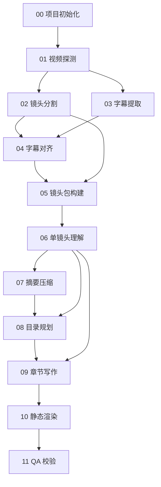

# 视频转网页多步骤落地总览设计

本文档是 `视频转网页设计.md` 的阶段化落地总览。目标不是一次性实现完整 Agent 系统，而是把能力拆成多个可独立运行、可单独验收、可断点复用的小步骤。

核心约束：

- 不使用数据库。
- 所有结构化中间结果都保存为 JSON / JSONL。
- 所有步骤的产物统一进入项目级 `outputs/` 目录。
- 每个独立步骤都必须有自己的阶段目录，例如 `outputs/{project_id}/media_info/`。
- 每个步骤都能独立运行，只依赖上一步的 JSON 产物和本地文件。
- 镜头分割优先复用 `D:\wrok\workPro2\Video2VisualPage\utils\opencv-shot-segmenter`。
- 字幕提取优先复用 `D:\wrok\workPro2\Video2VisualPage\utils\subtitle-extractor`。

---

## 1. 落地原则

### 1.1 每步都是一个可运行单元

每个步骤都需要满足：

| 要求 | 说明 |
| --- | --- |
| 有明确输入 | 输入视频、上一步 JSON、配置 JSON 或资源路径 |
| 有明确输出 | 输出一个或多个 JSON / JSONL 到当前步骤目录 `outputs/{project_id}/{step_name}/` |
| 有独立目录 | 每个步骤必须用独立文件夹包裹，例如 `media_info/` 只保存“01. 视频探测”的产物 |
| 可独立运行 | 可以通过命令单独执行当前步骤 |
| 可重复运行 | 重跑时覆盖或生成新的阶段产物，不依赖数据库状态 |
| 可校验 | 至少校验 JSON 是否合法、关键路径是否存在 |

### 1.2 工具做确定性处理，模型做语义处理

本地工具负责：

- 视频信息探测。
- 镜头切分。
- 关键帧抽取。
- 字幕提取。
- 字幕与镜头时间对齐。
- HTML 静态渲染。

模型负责：

- 单镜头图文理解。
- 镜头摘要压缩。
- 目录规划。
- 章节正文生成。

### 1.3 JSON 是唯一状态来源

不引入数据库表、ORM、SQLite、Redis 或任何服务端状态。流程状态、阶段产物、错误日志、缓存索引全部落到文件：

```txt
outputs/{project_id}/
  init/
    project.json
    run_state.json
    config.json
  logs/events.jsonl
  logs/errors.jsonl
```

---

## 2. 统一输出目录

建议在仓库根目录创建统一 `outputs/`，每次处理一个视频生成一个独立项目目录。

```txt
Video2VisualPage/
├── docs/
├── utils/
├── outputs/
│   └── demo_20260623_001/
│       ├── init/
│       │   ├── project.json
│       │   ├── run_state.json
│       │   └── config.json
│       │
│       ├── media_info/
│       │   └── media_info.json
│       │
│       ├── shot_split/
│       │   ├── shots.json
│       │   ├── normalized_shots.json
│       │   └── keyframes/
│       │
│       ├── subtitle_extract/
│       │   ├── subtitles.srt
│       │   ├── subtitles.json
│       │   └── asr_raw.json
│       │
│       ├── subtitle_align/
│       │   └── shot_subtitles.json
│       │
│       ├── shot_package/
│       │   └── shot_packages.jsonl
│       │
│       ├── shot_understanding/
│       │   └── shot_analysis.jsonl
│       │
│       ├── summary_reduce/
│       │   ├── chunk_summaries.jsonl
│       │   └── global_summary.json
│       │
│       ├── outline_plan/
│       │   └── outline.json
│       │
│       ├── chapter_write/
│       │   ├── chapter_001.json
│       │   ├── chapter_002.json
│       │   └── chapters_index.json
│       │
│       ├── static_render/
│       │   ├── index.html
│       │   ├── report.pdf
│       │   └── assets/
│       │
│       ├── qa/
│       │   └── qa_report.json
│       │
│       └── logs/
│           ├── events.jsonl
│           └── errors.jsonl
```

说明：

- `outputs/{project_id}/init/project.json` 记录项目元信息。
- `outputs/{project_id}/init/run_state.json` 记录阶段完成状态。
- 各步骤目录使用业务名，执行顺序由 `run_state.json` 中的阶段 ID 固定，便于排查和断点续跑。
- 每个阶段目录是对应独立步骤的写入边界，阶段产物不直接散落到 `outputs/{project_id}/` 根目录。
- 每个步骤目录固定写入 `step_manifest.json`，记录步骤名、运行状态、JSON / JSONL 产物和摘要结果。
- 大列表使用 JSONL，例如逐镜头分析结果。
- 图片、HTML、PDF 是文件产物，JSON 里只保存路径和元信息。

---

## 3. 总体阶段拆分

| 阶段 | 名称 | 阶段目录 | 实现目标 | 是否依赖模型 | 主要输出 |
| --- | --- | --- | --- | --- | --- |
| 00 | 项目初始化 | `init/` | 创建项目目录、配置、状态文件 | 否 | `project.json`, `run_state.json` |
| 01 | 视频探测 | `media_info/` | 获取时长、帧率、尺寸、音频信息 | 否 | `media_info.json` |
| 02 | 镜头分割 | `shot_split/` | 使用 OpenCV 工具切分镜头和抽关键帧 | 否 | `shots.json`, `normalized_shots.json` |
| 03 | 字幕提取 | `subtitle_extract/` | 使用字幕工具输出字幕 JSON / SRT | 否 | `subtitles.json`, `subtitles.srt` |
| 04 | 字幕对齐 | `subtitle_align/` | 按时间重叠把字幕归属到镜头 | 否 | `shot_subtitles.json` |
| 05 | 镜头包构建 | `shot_package/` | 合并镜头、关键帧、字幕为模型输入包 | 否 | `shot_packages.jsonl` |
| 06 | 单镜头理解 | `shot_understanding/` | 对每个镜头生成结构化镜头卡片 | 是 | `shot_analysis.jsonl` |
| 07 | 摘要压缩 | `summary_reduce/` | 分块压缩镜头卡片，生成全局摘要 | 是 | `chunk_summaries.jsonl`, `global_summary.json` |
| 08 | 目录规划 | `outline_plan/` | 生成文章目录并分配镜头到章节 | 是 | `outline.json` |
| 09 | 章节写作 | `chapter_write/` | 按章节生成正文 JSON | 是 | `chapter_*.json`, `chapters_index.json` |
| 10 | 静态渲染 | `static_render/` | 生成 HTML / PDF 静态产物 | 否 | `index.html`, `report.pdf` |
| 11 | QA 校验 | `qa/` | 检查 JSON、路径、引用、章节完整性 | 可选 | `qa_report.json` |

---

## 4. 阶段落地设计

### 00. 项目初始化

目标：给一个输入视频创建独立工作目录，并初始化 `init/` 阶段目录和状态文件。

阶段目录：

```txt
outputs/{project_id}/init/
```

输入：

```json
{
  "video_path": "D:/videos/demo.mp4",
  "project_name": "demo",
  "output_root": "D:/wrok/workPro2/Video2VisualPage/outputs"
}
```

输出：

```txt
outputs/{project_id}/init/project.json
outputs/{project_id}/init/run_state.json
outputs/{project_id}/init/config.json
```

`project.json` 示例：

```json
{
  "project_id": "demo_20260623_001",
  "input_video": "D:/videos/demo.mp4",
  "output_dir": "D:/wrok/workPro2/Video2VisualPage/outputs/demo_20260623_001",
  "created_at": "2026-06-23T00:00:00+08:00",
  "pipeline_version": "0.1.0"
}
```

独立运行入口示例：

```powershell
python -m video2visualpage init --video D:\videos\demo.mp4 --project-name demo
```

验收标准：

- 项目目录创建成功。
- `init/project.json` 可被正常解析。
- `init/run_state.json` 中所有阶段初始状态为 `pending`。
- `outputs/{project_id}/` 根目录下不直接散落项目初始化产物。

---

### 01. 视频探测

目标：获取视频基础信息，作为后续镜头、字幕、抽帧的时间基准。

阶段目录：

```txt
outputs/{project_id}/media_info/
```

输入：

```txt
outputs/{project_id}/init/project.json
```

输出：

```txt
outputs/{project_id}/media_info/media_info.json
```

`media_info.json` 示例：

```json
{
  "video_path": "D:/videos/demo.mp4",
  "duration_sec": 165.88,
  "fps": 25.0,
  "frame_count": 4147,
  "width": 1080,
  "height": 1920,
  "has_audio": true,
  "format": "mp4"
}
```

独立运行入口示例：

```powershell
python -m video2visualpage media-info --project outputs\demo_20260623_001
```

验收标准：

- 能获取 `duration_sec`、`fps`、`width`、`height`。
- 如果没有音频，要明确写出 `has_audio: false`，流程继续。

---

### 02. 镜头分割

目标：复用现有 OpenCV 镜头分割工具，输出镜头边界和关键帧。

阶段目录：

```txt
outputs/{project_id}/shot_split/
```

工具路径：

```txt
D:\wrok\workPro2\Video2VisualPage\utils\opencv-shot-segmenter
```

工具运行示例：

```powershell
cd D:\wrok\workPro2\Video2VisualPage\utils\opencv-shot-segmenter
python -m opencv_shot_segmenter `
  --video D:\videos\demo.mp4 `
  --output-dir D:\wrok\workPro2\Video2VisualPage\outputs\demo_20260623_001\02_shot_split `
  --keyframe-positions 0.2,0.8 `
  --shot-prefix shot
```

输入：

```txt
outputs/{project_id}/init/project.json
outputs/{project_id}/media_info/media_info.json
```

输出：

```txt
outputs/{project_id}/shot_split/shots.json
outputs/{project_id}/shot_split/normalized_shots.json
outputs/{project_id}/shot_split/keyframes/*.jpg
```

说明：

- `shots.json` 保留工具原始输出。
- `normalized_shots.json` 是给后续步骤使用的标准化版本。
- 默认只需要保存镜头边界和关键帧，不强制保存每个镜头视频片段。

`normalized_shots.json` 示例：

```json
{
  "video_path": "D:/videos/demo.mp4",
  "shot_count": 2,
  "shots": [
    {
      "shot_id": "shot_001",
      "start_sec": 0.0,
      "end_sec": 1.68,
      "duration_sec": 1.68,
      "keyframes": [
        {
          "position": 0.2,
          "time_sec": 0.336,
          "path": "outputs/demo_20260623_001/shot_split/keyframes/shot_001_fifth_1_20.jpg"
        },
        {
          "position": 0.8,
          "time_sec": 1.344,
          "path": "outputs/demo_20260623_001/shot_split/keyframes/shot_001_fifth_4_80.jpg"
        }
      ]
    }
  ]
}
```

独立运行入口示例：

```powershell
python -m video2visualpage shot-split --project outputs\demo_20260623_001
```

验收标准：

- `shots.json` 由工具生成。
- `normalized_shots.json` 中每个镜头都有 `shot_id`、`start_sec`、`end_sec`。
- 关键帧路径真实存在。

---

### 03. 字幕提取

目标：复用现有字幕提取工具，生成字幕文件和标准化字幕 JSON。

阶段目录：

```txt
outputs/{project_id}/subtitle_extract/
```

工具路径：

```txt
D:\wrok\workPro2\Video2VisualPage\utils\subtitle-extractor
```

工具运行示例：

```powershell
cd D:\wrok\workPro2\Video2VisualPage\utils\subtitle-extractor
python -m subtitle_extractor D:\videos\demo.mp4 `
  -o D:\wrok\workPro2\Video2VisualPage\outputs\demo_20260623_001\03_subtitle_extract\subtitles.json `
  --format json
```

输入：

```txt
outputs/{project_id}/init/project.json
outputs/{project_id}/media_info/media_info.json
```

输出：

```txt
outputs/{project_id}/subtitle_extract/subtitles.json
outputs/{project_id}/subtitle_extract/subtitles.srt
outputs/{project_id}/subtitle_extract/asr_raw.json
```

说明：

- `subtitles.json` 是后续流程使用的标准化字幕。
- `asr_raw.json` 可选，用来保存 ASR 原始结果。
- 如果无音频或识别失败，也要输出合法空字幕 JSON。

`subtitles.json` 示例：

```json
{
  "language": "zh",
  "source": "asr",
  "segments": [
    {
      "segment_id": "sub_0001",
      "start_sec": 1.06,
      "end_sec": 2.9,
      "text": "求你救救我娘"
    }
  ],
  "warnings": []
}
```

独立运行入口示例：

```powershell
python -m video2visualpage subtitle-extract --project outputs\demo_20260623_001
```

验收标准：

- `subtitles.json` 可被正常解析。
- 所有字幕时间统一使用秒。
- 无字幕时输出 `segments: []`，不阻断后续流程。

---

### 04. 字幕对齐

目标：把字幕按时间重叠关系归属到镜头。

阶段目录：

```txt
outputs/{project_id}/subtitle_align/
```

输入：

```txt
outputs/{project_id}/shot_split/normalized_shots.json
outputs/{project_id}/subtitle_extract/subtitles.json
```

输出：

```txt
outputs/{project_id}/subtitle_align/shot_subtitles.json
```

`shot_subtitles.json` 示例：

```json
{
  "items": [
    {
      "shot_id": "shot_001",
      "start_sec": 0.0,
      "end_sec": 1.68,
      "subtitle_text": "求你",
      "subtitle_segments": [
        {
          "segment_id": "sub_0001",
          "overlap_sec": 0.62,
          "overlap_ratio": 0.34,
          "text": "求你救救我娘"
        }
      ]
    }
  ]
}
```

独立运行入口示例：

```powershell
python -m video2visualpage subtitle-align --project outputs\demo_20260623_001
```

验收标准：

- 每个 `shot_id` 都有一条对齐记录。
- 字幕为空时，每个镜头的 `subtitle_text` 为空字符串。
- 跨镜头字幕要记录重叠比例。

---

### 05. 镜头包构建

目标：把镜头、关键帧、字幕组合成模型可读取的标准输入包。

阶段目录：

```txt
outputs/{project_id}/shot_package/
```

输入：

```txt
outputs/{project_id}/shot_split/normalized_shots.json
outputs/{project_id}/subtitle_align/shot_subtitles.json
```

输出：

```txt
outputs/{project_id}/shot_package/shot_packages.jsonl
```

`shot_packages.jsonl` 单行示例：

```json
{"shot_id":"shot_001","time_range":{"start_sec":0.0,"end_sec":1.68,"duration_sec":1.68},"frames":["outputs/demo_20260623_001/shot_split/keyframes/shot_001_fifth_1_20.jpg","outputs/demo_20260623_001/shot_split/keyframes/shot_001_fifth_4_80.jpg"],"subtitle_text":"求你","neighbor_context":{"previous_shot_id":null,"next_shot_id":"shot_002"}}
```

独立运行入口示例：

```powershell
python -m video2visualpage build-shot-packages --project outputs\demo_20260623_001
```

验收标准：

- 每个镜头对应一行 JSONL。
- 每行都能独立作为单镜头理解输入。
- 所有图片路径都存在或明确写入 `warnings`。

---

### 06. 单镜头理解

目标：逐镜头生成结构化镜头卡片，为后续大纲和正文提供材料。

阶段目录：

```txt
outputs/{project_id}/shot_understanding/
```

输入：

```txt
outputs/{project_id}/shot_package/shot_packages.jsonl
```

输出：

```txt
outputs/{project_id}/shot_understanding/shot_analysis.jsonl
```

`shot_analysis.jsonl` 单行示例：

```json
{"shot_id":"shot_001","visual_summary":"画面展示人物近景，情绪紧张。","subtitle_summary":"角色正在请求帮助。","merged_summary":"本镜头通过台词和近景表演建立求助情境。","key_entities":["人物","求助"],"topic_tags":["剧情推进"],"narrative_role":"introduction","importance_score":0.82,"recommended_display_frame":"outputs/demo_20260623_001/shot_split/keyframes/shot_001_fifth_1_20.jpg","confidence":0.78,"warnings":[]}
```

独立运行入口示例：

```powershell
python -m video2visualpage analyze-shots --project outputs\demo_20260623_001
```

验收标准：

- 每个镜头生成一条分析记录。
- 模型调用失败时直接报错，当前阶段标记为失败，避免写入伪成功分析。
- 输出必须是合法 JSONL。

---

### 07. 摘要压缩

目标：防止长视频上下文过大，把镜头卡片压缩为分块摘要和全局摘要。

阶段目录：

```txt
outputs/{project_id}/summary_reduce/
```

输入：

```txt
outputs/{project_id}/shot_understanding/shot_analysis.jsonl
```

输出：

```txt
outputs/{project_id}/summary_reduce/chunk_summaries.jsonl
outputs/{project_id}/summary_reduce/global_summary.json
```

`global_summary.json` 示例：

```json
{
  "video_main_theme": "视频内容围绕一段剧情冲突展开。",
  "main_sections": [
    "开场求助",
    "冲突升级",
    "人物关系揭示"
  ],
  "suggested_chapter_count": 3,
  "narrative_style": "剧情解读型"
}
```

独立运行入口示例：

```powershell
python -m video2visualpage reduce-summary --project outputs\demo_20260623_001
```

验收标准：

- 短视频可以只生成一个 chunk。
- 长视频按固定镜头数分块，例如每 30 到 50 个镜头一组。
- `global_summary.json` 不直接引用不存在的镜头。

---

### 08. 目录规划

目标：根据摘要和镜头卡片生成网页报告目录，并把镜头分配到章节。

阶段目录：

```txt
outputs/{project_id}/outline_plan/
```

输入：

```txt
outputs/{project_id}/shot_understanding/shot_analysis.jsonl
outputs/{project_id}/summary_reduce/global_summary.json
outputs/{project_id}/summary_reduce/chunk_summaries.jsonl
```

输出：

```txt
outputs/{project_id}/outline_plan/outline.json
```

`outline.json` 示例：

```json
{
  "title": "视频内容可视化解读",
  "description": "根据镜头、字幕和关键帧自动生成的结构化报告。",
  "chapters": [
    {
      "chapter_id": "chapter_001",
      "title": "开场求助",
      "summary": "介绍视频开头的核心冲突和人物诉求。",
      "shot_ids": ["shot_001", "shot_002", "shot_003"],
      "representative_shot_id": "shot_001"
    }
  ]
}
```

独立运行入口示例：

```powershell
python -m video2visualpage plan-outline --project outputs\demo_20260623_001
```

验收标准：

- 章节引用的 `shot_id` 必须存在。
- 章节顺序默认按视频时间线排列。
- 每章必须有 `representative_shot_id`。

---

### 09. 章节写作

目标：按章节生成正文 JSON，每章可以单独重跑。

阶段目录：

```txt
outputs/{project_id}/chapter_write/
```

输入：

```txt
outputs/{project_id}/outline_plan/outline.json
outputs/{project_id}/shot_understanding/shot_analysis.jsonl
outputs/{project_id}/summary_reduce/global_summary.json
```

输出：

```txt
outputs/{project_id}/chapter_write/chapter_001.json
outputs/{project_id}/chapter_write/chapter_002.json
outputs/{project_id}/chapter_write/chapters_index.json
```

`chapter_001.json` 示例：

```json
{
  "chapter_id": "chapter_001",
  "title": "开场求助",
  "representative_frame": "outputs/demo_20260623_001/shot_split/keyframes/shot_001_fifth_1_20.jpg",
  "body_markdown": "这一部分通过人物的求助台词和近景画面建立了故事的起点。",
  "key_points": [
    "角色处于求助状态",
    "字幕提供了明确的情节信息",
    "近景画面强化了紧张情绪"
  ],
  "referenced_shots": ["shot_001", "shot_002", "shot_003"]
}
```

独立运行入口示例：

```powershell
python -m video2visualpage write-chapters --project outputs\demo_20260623_001
python -m video2visualpage write-chapter --project outputs\demo_20260623_001 --chapter-id chapter_001
```

验收标准：

- 每个章节输出一个独立 JSON。
- 正文只能基于当前章节引用的镜头卡片生成。
- `representative_frame` 路径必须存在。

---

### 10. 静态渲染

目标：把章节 JSON 渲染为静态 HTML，并可选导出 PDF。

阶段目录：

```txt
outputs/{project_id}/static_render/
```

输入：

```txt
outputs/{project_id}/outline_plan/outline.json
outputs/{project_id}/chapter_write/*.json
```

输出：

```txt
outputs/{project_id}/static_render/index.html
outputs/{project_id}/static_render/report.pdf
outputs/{project_id}/static_render/assets/
```

独立运行入口示例：

```powershell
python -m video2visualpage render --project outputs\demo_20260623_001 --format html
python -m video2visualpage render --project outputs\demo_20260623_001 --format html,pdf
```

验收标准：

- HTML 可以直接用浏览器打开。
- 图片资源路径正确。
- PDF 生成失败不影响 HTML 产物，错误写入 `logs/errors.jsonl`。

---

### 11. QA 校验

目标：检查阶段产物是否完整、合法、可追溯。

阶段目录：

```txt
outputs/{project_id}/qa/
```

输入：

```txt
outputs/{project_id}/
```

输出：

```txt
outputs/{project_id}/qa/qa_report.json
```

`qa_report.json` 示例：

```json
{
  "status": "passed",
  "checks": [
    {
      "name": "json_parse",
      "status": "passed"
    },
    {
      "name": "outline_shot_refs",
      "status": "passed"
    },
    {
      "name": "chapter_images",
      "status": "passed"
    }
  ],
  "warnings": [],
  "errors": []
}
```

独立运行入口示例：

```powershell
python -m video2visualpage qa --project outputs\demo_20260623_001
```

验收标准：

- 所有 JSON / JSONL 可解析。
- `outline.json` 引用的镜头都存在。
- 章节引用的图片都存在。
- 缺失项写入 `errors`，不需要数据库记录。

---

## 5. 阶段依赖关系



---

## 6. MVP 推荐落地顺序

### MVP 1：先跑通确定性链路

目标：不接模型，先把视频拆成结构化素材。

包含阶段：

1. `00 项目初始化`
2. `01 视频探测`
3. `02 镜头分割`
4. `03 字幕提取`
5. `04 字幕对齐`
6. `05 镜头包构建`

验收结果：

```txt
outputs/{project_id}/shot_package/shot_packages.jsonl
```

只要这个文件稳定生成，后面模型分析就有标准输入。

### MVP 2：加入镜头理解和大纲

目标：接入模型，但只生成镜头卡片和目录。

新增阶段：

1. `06 单镜头理解`
2. `07 摘要压缩`
3. `08 目录规划`

验收结果：

```txt
outputs/{project_id}/shot_understanding/shot_analysis.jsonl
outputs/{project_id}/outline_plan/outline.json
```

### MVP 3：生成网页报告

目标：完整输出静态 HTML。

新增阶段：

1. `09 章节写作`
2. `10 静态渲染`
3. `11 QA 校验`

验收结果：

```txt
outputs/{project_id}/static_render/index.html
outputs/{project_id}/qa/qa_report.json
```

---

## 7. run_state.json 设计

`run_state.json` 放在 `init/` 阶段目录中，只记录阶段状态，不承担数据库角色。

```json
{
  "project_id": "demo_20260623_001",
  "pipeline_version": "0.1.0",
  "stages": [
    {
      "stage_id": "00_init",
      "name": "项目初始化",
      "stage_dir": "init",
      "status": "done",
      "outputs": ["init/project.json", "init/run_state.json", "init/config.json"]
    },
    {
      "stage_id": "01_media_probe",
      "name": "视频探测",
      "stage_dir": "media_info",
      "status": "done",
      "outputs": ["media_info/media_info.json"]
    },
    {
      "stage_id": "02_shot_split",
      "name": "镜头分割",
      "stage_dir": "shot_split",
      "status": "pending",
      "outputs": []
    }
  ],
  "updated_at": "2026-06-23T00:00:00+08:00"
}
```

状态枚举：

| 状态 | 含义 |
| --- | --- |
| `pending` | 尚未运行 |
| `running` | 正在运行 |
| `done` | 已完成 |
| `failed` | 运行失败 |
| `skipped` | 明确跳过 |

---

## 8. 阶段开发文档索引

当前文档作为总览，具体落地开发请进入 `docs/stages/`。每个阶段都有独立 `README.md`，包含目标、输入输出、数据契约、实现任务、异常处理、CLI 和验收清单：

```txt
docs/
  视频转网页设计.md
  视频转网页多步骤落地总览.md
  stages/
    init/
      README.md
    media_info/
      README.md
    shot_split/
      README.md
    subtitle_extract/
      README.md
    subtitle_align/
      README.md
    shot_package/
      README.md
    shot_understanding/
      README.md
    summary_reduce/
      README.md
    outline_plan/
      README.md
    chapter_write/
      README.md
    static_render/
      README.md
    qa/
      README.md
```

阶段入口：

| 阶段 | 开发文档 |
| --- | --- |
| 00 项目初始化 | `docs/stages/init/README.md` |
| 01 视频探测 | `docs/stages/media_info/README.md` |
| 02 镜头分割 | `docs/stages/shot_split/README.md` |
| 03 字幕提取 | `docs/stages/subtitle_extract/README.md` |
| 04 字幕对齐 | `docs/stages/subtitle_align/README.md` |
| 05 镜头包构建 | `docs/stages/shot_package/README.md` |
| 06 单镜头理解 | `docs/stages/shot_understanding/README.md` |
| 07 摘要压缩 | `docs/stages/summary_reduce/README.md` |
| 08 目录规划 | `docs/stages/outline_plan/README.md` |
| 09 章节写作 | `docs/stages/chapter_write/README.md` |
| 10 静态渲染 | `docs/stages/static_render/README.md` |
| 11 QA 校验 | `docs/stages/qa/README.md` |

推荐下一步从 MVP 1 开始实现：`00_init` 到 `05_shot_package`。这条链路跑通后，后续模型分析就能稳定读取标准化 `shot_packages.jsonl`。

---

## 9. 一句话总结

本项目应按“本地文件流水线”落地：每一步都读取上一步产出的 JSON / JSONL，处理一小块明确功能，再把自己的 JSON 结果写回 `outputs/{project_id}/{step_name}/`；镜头分割和字幕提取先复用现有工具，后续模型分析、目录规划、章节写作都建立在标准化镜头包之上，全流程不引入数据库。

