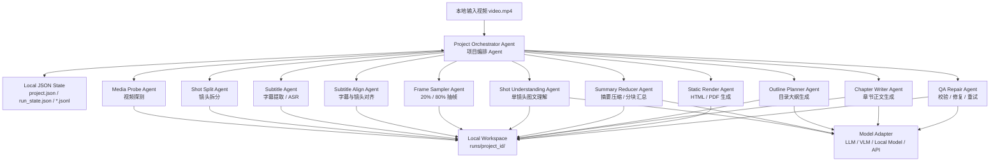
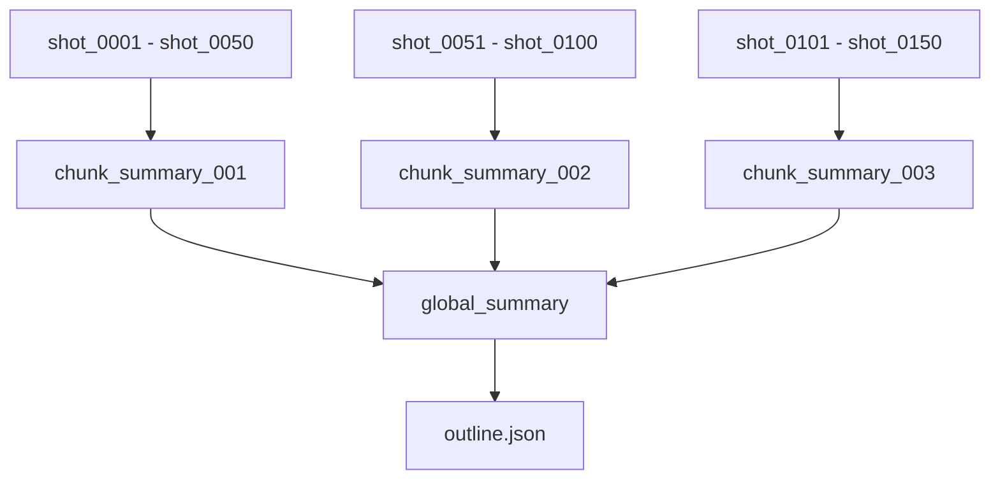
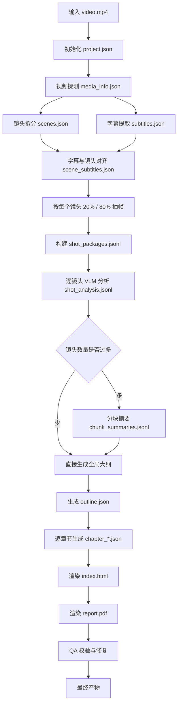

下面把你的草稿升级成一个**完整可落地的本地 Agent 产品架构**。它不是后端服务，也不是前端项目，而是一个本地运行的 Agent 工作流：输入视频，产出静态 HTML / PDF，并把所有中间状态落到本地 JSON 文件。

---

# 1. 产品定位

项目名可以暂定为：

**Video2VisualPage Agent**

一句话定义：

> 把一个视频自动拆成镜头、字幕、关键帧、镜头理解、章节大纲、章节正文，最后生成带图文结构的静态 HTML / PDF 报告。

边界非常明确：

| 项目项               | 是否设计              |
| ----------------- | ----------------- |
| Agent 调度架构        | 设计                |
| 本地文件处理            | 设计                |
| 本地 JSON 状态存储      | 设计                |
| 镜头拆分、字幕、抽帧、LLM 分析 | 设计                |
| HTML / PDF 静态产物生成 | 设计                |
| 后端 API 服务         | 不设计               |
| 数据库               | 不使用               |
| 远程服务器 / 远程存储      | 不设计               |
| 前端应用              | 不设计               |
| HTML 页面           | 只作为最终静态产物，不作为前端系统 |

底层媒体工具可以选择 FFmpeg、PySceneDetect、Whisper 系列 ASR 等。PySceneDetect 适合做镜头变化检测与切分，FFmpeg 适合做本地视频/音频/帧抽取，Whisper 可用于多语言语音识别、翻译和语言检测。([Scenedetect][1])

---

# 2. 总体 Agent 架构图



这个架构的核心不是“多个 Agent 自由聊天”，而是：

> **一个 Orchestrator Agent 编排多个专业 Agent 节点，每个节点输入明确、输出明确、可校验、可重试、可断点续跑。**

---

# 3. 本地目录结构设计

建议每个视频生成一个独立运行目录。

```txt
video2visualpage/
├── input/
│   └── demo.mp4
│
├── runs/
│   └── demo_20260622_001/
│       ├── project.json
│       ├── run_state.json
│       ├── config.json
│       │
│       ├── media/
│       │   ├── media_info.json
│       │   ├── audio.wav
│       │   └── source_hash.txt
│       │
│       ├── scenes/
│       │   ├── scenes.json
│       │   └── scene_index.json
│       │
│       ├── subtitles/
│       │   ├── subtitles.srt
│       │   ├── subtitles.json
│       │   └── scene_subtitles.json
│       │
│       ├── frames/
│       │   ├── shot_0001_20.jpg
│       │   ├── shot_0001_80.jpg
│       │   ├── shot_0002_20.jpg
│       │   └── shot_0002_80.jpg
│       │
│       ├── analysis/
│       │   ├── shot_packages.jsonl
│       │   ├── shot_analysis.jsonl
│       │   ├── chunk_summaries.jsonl
│       │   └── global_summary.json
│       │
│       ├── outline/
│       │   ├── outline.json
│       │   └── chapter_plan.json
│       │
│       ├── chapters/
│       │   ├── chapter_001.json
│       │   ├── chapter_002.json
│       │   └── chapter_003.json
│       │
│       ├── output/
│       │   ├── index.html
│       │   ├── report.pdf
│       │   └── assets/
│       │       └── images/
│       │
│       └── logs/
│           ├── events.jsonl
│           ├── errors.jsonl
│           └── llm_calls.jsonl
```

这里没有数据库，所有状态都是本地 JSON / JSONL。

建议规则：

* **小文件用 JSON**：例如 `project.json`、`outline.json`。
* **大量列表用 JSONL**：例如 `shot_analysis.jsonl`，每个镜头一行，方便断点续跑。
* **二进制资源单独存文件**：视频、音频、图片、HTML、PDF 不塞进 JSON。
* **JSON 只存路径和元信息**。

---

# 4. Agent 分工设计

## 4.1 Project Orchestrator Agent

这是总控 Agent。

职责：

1. 创建项目目录。
2. 初始化 `project.json`、`run_state.json`。
3. 按顺序调用各个 Agent。
4. 判断某一步是否已完成。
5. 失败时重试或降级。
6. 保存每一步产物路径。
7. 最后触发 HTML / PDF 生成。

它不直接做视频处理，也不直接写正文，只负责调度。

核心状态示例：

```json
{
  "project_id": "demo_20260622_001",
  "input_video": "input/demo.mp4",
  "workspace": "runs/demo_20260622_001",
  "current_stage": "shot_analysis",
  "completed_stages": [
    "media_probe",
    "shot_split",
    "subtitle_extract",
    "subtitle_align",
    "frame_sample"
  ],
  "failed_stages": [],
  "artifacts": {
    "media_info": "media/media_info.json",
    "scenes": "scenes/scenes.json",
    "subtitles": "subtitles/subtitles.json",
    "frames": "frames/",
    "shot_analysis": "analysis/shot_analysis.jsonl",
    "outline": "outline/outline.json",
    "html": "output/index.html",
    "pdf": "output/report.pdf"
  }
}
```

---

## 4.2 Media Probe Agent

负责探测视频基础信息。

输入：

```json
{
  "video_path": "input/demo.mp4"
}
```

输出：

```json
{
  "duration_sec": 632.4,
  "fps": 25,
  "width": 1920,
  "height": 1080,
  "has_audio": true,
  "has_subtitle_track": false,
  "format": "mp4",
  "video_codec": "h264",
  "audio_codec": "aac"
}
```

主要作用：

* 判断是否有音频。
* 判断是否有内嵌字幕。
* 获取视频总时长。
* 计算后续镜头时间戳、抽帧时间戳。
* 为异常处理提供依据。

---

## 4.3 Shot Split Agent

负责镜头拆分。

你的原始草稿是“对视频做镜头拆分”，这里要增强成两种模式：

### 模式一：只保存镜头边界

推荐默认使用。

不真的切出每个小视频，只保存开始和结束时间。

优点：

* 速度快。
* 节省磁盘。
* 后续抽帧可以直接按时间戳取。
* 对本地 JSON 架构更友好。

输出 `scenes.json`：

```json
{
  "video_path": "input/demo.mp4",
  "scene_count": 124,
  "scenes": [
    {
      "shot_id": "shot_0001",
      "start_sec": 0.0,
      "end_sec": 5.72,
      "duration_sec": 5.72
    },
    {
      "shot_id": "shot_0002",
      "start_sec": 5.72,
      "end_sec": 12.48,
      "duration_sec": 6.76
    }
  ]
}
```

### 模式二：物理切分视频片段

作为可选增强。

只有当你后面需要给某个模型输入单独 clip 时才需要。

```txt
scenes/clips/
├── shot_0001.mp4
├── shot_0002.mp4
└── shot_0003.mp4
```

生产建议：

> MVP 阶段只保存镜头边界，不保存每个镜头视频文件。

---

## 4.4 Subtitle Agent

负责字幕提取。

分三种情况：

### 情况一：视频自带字幕轨

直接提取字幕。

输出：

```txt
subtitles/subtitles.srt
subtitles/subtitles.json
```

### 情况二：没有字幕但有音频

先提取音频，再做 ASR。

```txt
media/audio.wav
subtitles/subtitles.srt
subtitles/subtitles.json
```

### 情况三：没有音频

生成空字幕文件，但流程继续。

```json
{
  "segments": [],
  "warning": "no_audio_detected"
}
```

字幕 JSON 建议结构：

```json
{
  "language": "zh",
  "segments": [
    {
      "segment_id": "sub_0001",
      "start_sec": 1.2,
      "end_sec": 4.8,
      "text": "今天我们来看一个非常有意思的项目。"
    },
    {
      "segment_id": "sub_0002",
      "start_sec": 5.1,
      "end_sec": 8.7,
      "text": "它可以把视频自动转换成网页。"
    }
  ]
}
```

---

## 4.5 Subtitle Align Agent

负责把字幕对齐到每个镜头。

逻辑：

```txt
某字幕段和某镜头时间区间有重叠
=> 该字幕归属于这个镜头
```

例如：

```json
{
  "shot_id": "shot_0001",
  "start_sec": 0.0,
  "end_sec": 5.72,
  "subtitle_text": "今天我们来看一个非常有意思的项目。",
  "subtitle_segments": [
    "sub_0001"
  ]
}
```

增强点：

如果字幕跨越多个镜头，可以按重叠比例拆分归属。

```json
{
  "segment_id": "sub_0003",
  "text": "接下来我们进入第二部分。",
  "belongs_to": [
    {
      "shot_id": "shot_0005",
      "overlap_ratio": 0.35
    },
    {
      "shot_id": "shot_0006",
      "overlap_ratio": 0.65
    }
  ]
}
```

---

## 4.6 Frame Sampler Agent

你的原始方案是：

> 每个镜头从 20% 和 80% 处提取两帧。

这是合理的，但生产级需要加容错。

计算方式：

```txt
t20 = shot_start + duration * 0.2
t80 = shot_start + duration * 0.8
```

输出：

```json
{
  "shot_id": "shot_0001",
  "frames": [
    {
      "frame_id": "shot_0001_20",
      "ratio": 0.2,
      "time_sec": 1.14,
      "path": "frames/shot_0001_20.jpg",
      "quality_score": 0.86
    },
    {
      "frame_id": "shot_0001_80",
      "ratio": 0.8,
      "time_sec": 4.57,
      "path": "frames/shot_0001_80.jpg",
      "quality_score": 0.79
    }
  ],
  "display_frame": "frames/shot_0001_20.jpg"
}
```

增强规则：

| 问题       | 处理方式                |
| -------- | ------------------- |
| 镜头太短     | 改抽 50% 一帧           |
| 20% 帧是黑屏 | 改抽 35%              |
| 80% 帧模糊  | 改抽 65%              |
| 两帧几乎一样   | 保留一帧，标记 duplicate   |
| 镜头小于 1 秒 | 合并到相邻镜头，或只做低优先级分析   |
| 抽帧失败     | 记录错误，后续章节仍然可以只用字幕生成 |

---

## 4.7 Shot Package Builder

这是一个很关键的中间层。

它把镜头、字幕、帧组合成大模型可用的输入包。

输出 `shot_packages.jsonl`：

```json
{
  "shot_id": "shot_0001",
  "time_range": {
    "start_sec": 0.0,
    "end_sec": 5.72,
    "duration_sec": 5.72
  },
  "frames": [
    "frames/shot_0001_20.jpg",
    "frames/shot_0001_80.jpg"
  ],
  "subtitle_text": "今天我们来看一个非常有意思的项目。",
  "neighbor_context": {
    "previous_shot_id": null,
    "next_shot_id": "shot_0002"
  }
}
```

为什么需要这个中间层？

因为后面的 VLM / LLM 不应该直接读散乱文件，而是统一读标准化 JSON。

---

## 4.8 Shot Understanding Agent

这是第一个真正调用大模型的 Agent。

输入：

* 当前镜头两帧。
* 当前镜头字幕。
* 当前镜头时间戳。
* 可选：前后镜头一句摘要。

输出 `shot_analysis.jsonl`：

```json
{
  "shot_id": "shot_0001",
  "start_sec": 0.0,
  "end_sec": 5.72,
  "visual_summary": "画面展示了一个软件界面，左侧是视频预览区域，右侧可能是内容分析面板。",
  "subtitle_summary": "讲解者正在介绍一个可以把视频转换成网页的项目。",
  "merged_summary": "本镜头用于引入项目主题：将视频内容自动解析并转成结构化网页。",
  "key_entities": [
    "视频转网页",
    "软件界面",
    "内容分析"
  ],
  "actions": [
    "展示项目界面",
    "介绍核心功能"
  ],
  "on_screen_text": [
    "Video",
    "HTML",
    "Analysis"
  ],
  "topic_tags": [
    "项目介绍",
    "功能概览"
  ],
  "narrative_role": "introduction",
  "importance_score": 0.92,
  "recommended_display_frame": "frames/shot_0001_20.jpg",
  "confidence": 0.87,
  "warnings": []
}
```

这一层不要生成长文，只生成**镜头卡片**。

镜头卡片的目标是：

> 把视频压缩成可组合、可检索、可写作的结构化材料。

---

## 4.9 Summary Reducer Agent

这是防止上下文爆炸的关键。

你的原始方案是：

> 把所有摘要再放一起，让大模型生成目录大纲。

如果视频很短可以这样做，但如果有几百个镜头，直接塞给模型会爆上下文。

生产级应该用 Map-Reduce：



分块摘要结构：

```json
{
  "chunk_id": "chunk_001",
  "shot_range": ["shot_0001", "shot_0050"],
  "main_topics": [
    "项目背景",
    "功能演示",
    "视频处理流程"
  ],
  "summary": "这一段主要介绍项目目标，并展示视频转网页的基础流程。",
  "important_shots": [
    "shot_0001",
    "shot_0012",
    "shot_0038"
  ]
}
```

全局摘要结构：

```json
{
  "video_main_theme": "将视频自动转换为可视化网页报告",
  "main_sections": [
    "项目目标",
    "视频处理流程",
    "AI 分析流程",
    "网页生成结果"
  ],
  "suggested_chapter_count": 4,
  "narrative_style": "技术讲解型"
}
```

---

## 4.10 Outline Planner Agent

负责生成目录大纲，并把镜头分配到章节。

输出 `outline.json`：

```json
{
  "title": "视频转可视化网页系统解析",
  "description": "本文根据视频内容自动生成，按主题组织为多个章节，并保留关键镜头图像。",
  "chapters": [
    {
      "chapter_id": "chapter_001",
      "title": "项目目标与整体思路",
      "summary": "介绍为什么要把视频转换成网页，以及项目解决的问题。",
      "shot_ids": [
        "shot_0001",
        "shot_0002",
        "shot_0003"
      ],
      "representative_shot_id": "shot_0001"
    },
    {
      "chapter_id": "chapter_002",
      "title": "视频拆解：镜头、字幕与关键帧",
      "summary": "说明系统如何把视频拆成可分析的结构化素材。",
      "shot_ids": [
        "shot_0004",
        "shot_0005",
        "shot_0006"
      ],
      "representative_shot_id": "shot_0005"
    }
  ]
}
```

目录生成时要遵守几个规则：

1. 章节必须引用真实存在的 `shot_id`。
2. 一个镜头可以只属于一个主章节。
3. 章节顺序默认按视频时间线排序。
4. 章节标题不能凭空创造视频中没有的信息。
5. 每章必须选择一个代表镜头。
6. 如果镜头太多，优先选高 `importance_score` 的镜头展示。

---

## 4.11 Chapter Writer Agent

负责生成每个章节的完整内容。

它不能读取全部视频资料，只读取：

* 当前章节的大纲。
* 当前章节包含的镜头卡片。
* 当前章节代表帧。
* 可选：全局摘要。

输入：

```json
{
  "chapter": {
    "chapter_id": "chapter_002",
    "title": "视频拆解：镜头、字幕与关键帧",
    "shot_ids": [
      "shot_0004",
      "shot_0005",
      "shot_0006"
    ]
  },
  "shot_cards": [
    {
      "shot_id": "shot_0004",
      "merged_summary": "系统开始展示视频拆分流程。"
    },
    {
      "shot_id": "shot_0005",
      "merged_summary": "画面显示从每个镜头中抽取关键帧。"
    }
  ]
}
```

输出 `chapter_002.json`：

```json
{
  "chapter_id": "chapter_002",
  "title": "视频拆解：镜头、字幕与关键帧",
  "representative_frame": "frames/shot_0005_20.jpg",
  "body_markdown": "这一部分展示了系统如何把原始视频拆解成可分析的结构化素材。首先，系统根据画面变化识别镜头边界；随后提取字幕，并将字幕按时间戳对齐到对应镜头；最后，每个镜头会抽取 20% 和 80% 两个位置的关键帧，为后续视觉理解提供输入。",
  "referenced_shots": [
    "shot_0004",
    "shot_0005",
    "shot_0006"
  ],
  "key_points": [
    "镜头拆分用于建立视频结构",
    "字幕对齐用于补充语义信息",
    "关键帧用于提供视觉证据"
  ]
}
```

---

## 4.12 Static Render Agent

负责把章节 JSON 拼接成 HTML / PDF。

它不需要前端框架。

建议用本地模板渲染：

```txt
template.html
chapter_section.html
style.css
```

最终 HTML 结构：

```html
<!DOCTYPE html>
<html>
<head>
  <meta charset="utf-8" />
  <title>视频转可视化网页报告</title>
  <link rel="stylesheet" href="./assets/style.css" />
</head>
<body>
  <article>
    <h1>视频转可视化网页系统解析</h1>

    <nav>
      <h2>目录</h2>
      <ol>
        <li><a href="#chapter_001">项目目标与整体思路</a></li>
        <li><a href="#chapter_002">视频拆解：镜头、字幕与关键帧</a></li>
      </ol>
    </nav>

    <section id="chapter_001">
      <h2>项目目标与整体思路</h2>
      
      <p>这一部分介绍项目的目标...</p>
    </section>

    <section id="chapter_002">
      <h2>视频拆解：镜头、字幕与关键帧</h2>
      
      <p>这一部分展示系统如何把原始视频拆解成结构化素材...</p>
    </section>
  </article>
</body>
</html>
```

PDF 生成方式：

```txt
chapters/*.json
        ↓
index.html
        ↓
report.pdf
```

HTML 是主产物，PDF 是从 HTML 渲染出来的副产物。

---

# 5. 核心 Prompt 设计

## 5.1 单镜头分析 Prompt

```txt
你是 Shot Understanding Agent，负责分析视频中的单个镜头。

你会收到：
1. shot_id
2. 镜头开始和结束时间
3. 两张关键帧
4. 当前镜头对应字幕
5. 可选的前后镜头摘要

你的任务：
- 结合画面和字幕理解这个镜头在视频中的作用。
- 不要生成长文章。
- 不要猜测画面之外的信息。
- 如果字幕和画面冲突，要分别说明。
- 输出必须是合法 JSON。

输出字段：
{
  "shot_id": string,
  "visual_summary": string,
  "subtitle_summary": string,
  "merged_summary": string,
  "key_entities": string[],
  "actions": string[],
  "on_screen_text": string[],
  "topic_tags": string[],
  "narrative_role": "introduction" | "explanation" | "demo" | "transition" | "conclusion" | "unknown",
  "importance_score": number,
  "recommended_display_frame": string,
  "confidence": number,
  "warnings": string[]
}
```

---

## 5.2 目录生成 Prompt

```txt
你是 Outline Planner Agent，负责根据视频镜头摘要生成文章目录。

你会收到：
1. 视频全局摘要
2. 分块摘要
3. 所有镜头的压缩卡片，包括 shot_id、时间、摘要、标签、重要性评分

你的任务：
- 生成适合 HTML / PDF 报告的目录结构。
- 每个章节必须引用真实存在的 shot_id。
- 章节顺序应尽量遵循视频时间线。
- 章节数量控制在 3 到 8 个之间。
- 每章必须选择一个 representative_shot_id。
- 不要编造视频中没有出现的信息。

输出 JSON：
{
  "title": string,
  "description": string,
  "chapters": [
    {
      "chapter_id": string,
      "title": string,
      "summary": string,
      "shot_ids": string[],
      "representative_shot_id": string
    }
  ]
}
```

---

## 5.3 章节写作 Prompt

```txt
你是 Chapter Writer Agent，负责把一个章节涉及的镜头内容写成完整正文。

你会收到：
1. 当前章节标题
2. 当前章节摘要
3. 当前章节包含的 shot_cards
4. 代表镜头帧路径
5. 全局视频主题

写作要求：
- 只基于给定镜头内容写作。
- 不要添加视频中没有的信息。
- 用清晰、解释型的中文表达。
- 每章正文应有连贯叙述，不要只是罗列镜头。
- 需要保留 referenced_shots，方便回溯。

输出 JSON：
{
  "chapter_id": string,
  "title": string,
  "representative_frame": string,
  "body_markdown": string,
  "key_points": string[],
  "referenced_shots": string[]
}
```

---

# 6. 本地 JSON 状态机制

不要用数据库，但要做到类似数据库的可靠性。

## 6.1 run_state.json

```json
{
  "project_id": "demo_20260622_001",
  "pipeline_version": "0.1.0",
  "tasks": [
    {
      "task_id": "media_probe",
      "agent": "MediaProbeAgent",
      "status": "done",
      "output": "media/media_info.json"
    },
    {
      "task_id": "shot_split",
      "agent": "ShotSplitAgent",
      "status": "done",
      "output": "scenes/scenes.json"
    },
    {
      "task_id": "shot_analysis:shot_0001",
      "agent": "ShotUnderstandingAgent",
      "status": "done",
      "output_ref": "analysis/shot_analysis.jsonl#shot_0001"
    },
    {
      "task_id": "shot_analysis:shot_0002",
      "agent": "ShotUnderstandingAgent",
      "status": "pending"
    }
  ]
}
```

## 6.2 events.jsonl

```json
{"time":"2026-06-22T21:01:00+08:00","event":"project_created","project_id":"demo_20260622_001"}
{"time":"2026-06-22T21:01:08+08:00","event":"media_probe_done","duration_sec":632.4}
{"time":"2026-06-22T21:02:20+08:00","event":"scene_split_done","scene_count":124}
```

## 6.3 errors.jsonl

```json
{
  "time": "2026-06-22T21:03:11+08:00",
  "stage": "frame_sample",
  "shot_id": "shot_0042",
  "error": "black_frame_detected",
  "action": "retry_with_50_percent_frame"
}
```

建议所有 JSON 写入都采用：

```txt
写入临时文件 xxx.tmp
        ↓
校验 JSON
        ↓
原子重命名为 xxx.json
```

避免运行中断导致 JSON 损坏。

---

# 7. 完整流水线



---

# 8. 上下文爆炸怎么解决

你的原始流程里最容易爆炸的是这一步：

> 把所有摘要再放一起，让大模型生成目录大纲。

生产级不要直接这么做。

改成三层压缩：

```txt
镜头级分析
shot_analysis.jsonl
        ↓
每 30～50 个镜头生成一个 chunk_summary
chunk_summaries.jsonl
        ↓
用 chunk_summary 生成 global_summary 和 outline
outline.json
        ↓
每章只读取本章相关 shot_cards
chapter_001.json / chapter_002.json
```

也就是说：

* 单镜头分析只看当前镜头。
* 目录生成只看压缩后的镜头卡片或分块摘要。
* 章节生成只看当前章节关联镜头。
* 最终渲染只读章节 JSON。

这就不会因为视频变长而直接上下文爆炸。

---

# 9. QA Repair Agent 设计

生产级一定要有 QA Agent。

它不负责创作，而是负责检查。

检查项：

| 检查项          | 规则                            |
| ------------ | ----------------------------- |
| JSON 合法性     | 所有 LLM 输出必须能 parse            |
| shot_id 是否存在 | outline 里引用的 shot_id 必须真实存在   |
| 图片路径是否存在     | 每章 representative_frame 必须能找到 |
| 章节是否为空       | body_markdown 不能为空            |
| 章节顺序是否合理     | 默认按代表镜头时间排序                   |
| 是否遗漏重要镜头     | 高 importance_score 的镜头不能全部被忽略 |
| 是否幻觉         | 章节内容不能出现 shot_cards 里没有的信息    |
| PDF 是否生成成功   | 失败时保留 HTML 并记录错误              |
| 字幕为空是否处理     | 允许无字幕视频继续生成视觉报告               |

错误修复策略：

```txt
JSON 不合法
=> JSON Repair Prompt

图片路径不存在
=> 重新选择该章节已有镜头的 display_frame

章节内容太短
=> 重新调用 Chapter Writer Agent

某些镜头未分配章节
=> 追加到最近主题章节，或生成“补充镜头”章节

PDF 失败
=> 不阻断 HTML 输出，记录 pdf_render_failed
```

---

# 10. 配置文件设计

`config.json`：

```json
{
  "scene_detection": {
    "mode": "adaptive",
    "min_scene_duration_sec": 1.0,
    "fallback_mode": "fixed_interval",
    "fixed_interval_sec": 8
  },
  "subtitle": {
    "prefer_embedded_subtitle": true,
    "asr_enabled": true,
    "language": "auto"
  },
  "frame_sampling": {
    "ratios": [0.2, 0.8],
    "fallback_ratios": [0.35, 0.5, 0.65],
    "quality_check": true
  },
  "llm": {
    "shot_analysis_model": "vision-model",
    "outline_model": "text-model",
    "chapter_model": "text-model",
    "max_shots_per_chunk": 50,
    "json_mode": true
  },
  "render": {
    "output_html": true,
    "output_pdf": true,
    "theme": "clean_report",
    "include_timeline": true,
    "include_shot_references": true
  }
}
```

---

# 11. 推荐 MVP 版本

先不要一上来做太复杂。

## MVP 1：本地可跑通版本

包含：

1. 输入一个本地视频。
2. 探测视频信息。
3. 镜头拆分，保存 `scenes.json`。
4. 提取或生成字幕，保存 `subtitles.json`。
5. 每个镜头抽 20% / 80% 两帧。
6. 每个镜头生成 `shot_analysis.jsonl`。
7. 生成 `outline.json`。
8. 每章生成 `chapter_*.json`。
9. 输出 `index.html`。
10. 可选输出 `report.pdf`。

暂时不做：

* 高级镜头合并。
* OCR 专门模块。
* 复杂模板主题。
* 人工编辑流程。
* 多视频批处理。

---

## MVP 2：生产增强版本

加入：

1. 断点续跑。
2. JSON Schema 校验。
3. LLM 输出自动修复。
4. 黑帧 / 模糊帧检测。
5. 镜头过多时 Map-Reduce 摘要。
6. 章节引用完整性检查。
7. 日志和错误恢复。
8. 可编辑 `outline.json` 后重新生成章节。
9. 多种报告模板。
10. 本地缓存，避免重复分析同一个镜头。

---

# 12. 最小代码模块划分

不设计后端，但可以设计本地 Python 包结构。

```txt
video2visualpage/
├── main.py
├── agents/
│   ├── orchestrator.py
│   ├── media_probe_agent.py
│   ├── shot_split_agent.py
│   ├── subtitle_agent.py
│   ├── subtitle_align_agent.py
│   ├── frame_sampler_agent.py
│   ├── shot_understanding_agent.py
│   ├── summary_reducer_agent.py
│   ├── outline_planner_agent.py
│   ├── chapter_writer_agent.py
│   ├── static_render_agent.py
│   └── qa_repair_agent.py
│
├── tools/
│   ├── ffmpeg_tool.py
│   ├── scene_detect_tool.py
│   ├── asr_tool.py
│   ├── image_quality_tool.py
│   └── html_pdf_tool.py
│
├── storage/
│   ├── json_store.py
│   ├── jsonl_store.py
│   └── artifact_store.py
│
├── models/
│   ├── llm_adapter.py
│   ├── vision_adapter.py
│   └── schemas.py
│
├── prompts/
│   ├── shot_analysis_prompt.txt
│   ├── outline_prompt.txt
│   ├── chapter_writer_prompt.txt
│   └── json_repair_prompt.txt
│
├── templates/
│   ├── report.html
│   ├── chapter.html
│   └── style.css
│
└── utils/
    ├── timecode.py
    ├── hashing.py
    ├── logging.py
    └── validation.py
```

---

# 13. CLI 运行方式

不需要后端，直接命令行运行：

```bash
python main.py run input/demo.mp4
```

带参数：

```bash
python main.py run input/demo.mp4 \
  --project-name demo \
  --output html,pdf \
  --scene-mode adaptive \
  --asr auto \
  --chapter-count auto
```

断点续跑：

```bash
python main.py resume runs/demo_20260622_001
```

只重新生成章节：

```bash
python main.py rerun runs/demo_20260622_001 --from outline
```

只重新渲染 HTML / PDF：

```bash
python main.py render runs/demo_20260622_001
```

---

# 14. 最终产物

```txt
output/
├── index.html
├── report.pdf
└── assets/
    ├── style.css
    └── images/
        ├── shot_0001_20.jpg
        ├── shot_0005_20.jpg
        └── shot_0012_80.jpg
```

HTML 报告结构建议：

```txt
标题
摘要
目录
章节 1
  代表镜头图片
  正文
  关键点
  涉及镜头列表
章节 2
  代表镜头图片
  正文
  关键点
  涉及镜头列表
附录
  镜头时间线
  全部镜头摘要
```

---

# 15. 这个架构的关键设计思想

最重要的是这几条：

1. **工具做确定性任务，模型做语义任务。**
   镜头拆分、抽帧、字幕对齐不交给大模型。

2. **每个 Agent 输出 JSON。**
   不让 Agent 直接互相传自然语言，避免不可控。

3. **所有中间结果可落盘。**
   出错可以从任意阶段恢复。

4. **不要一次性把所有镜头塞给模型。**
   长视频必须用分块摘要和章节局部生成。

5. **HTML 是最终静态产物，不是前端系统。**
   所以不需要 React、Vue、后端 API、数据库。

6. **镜头卡片是核心资产。**
   一旦 `shot_analysis.jsonl` 生成，后续可以反复生成不同风格的文章、网页、学习笔记、分镜稿、PPT 大纲。

---

# 16. 最终架构一句话总结

这个项目应该设计成：

> **一个本地可断点续跑的 Agent Pipeline：用工具把视频拆成镜头、字幕和关键帧，用 VLM/LLM 把镜头转成结构化镜头卡片，再通过分块摘要生成目录和章节，最后用本地模板渲染静态 HTML / PDF；所有状态、缓存、日志和分析结果都保存在本地 JSON / JSONL 文件中。**

[1]: https://www.scenedetect.com/ "Home - PySceneDetect"
