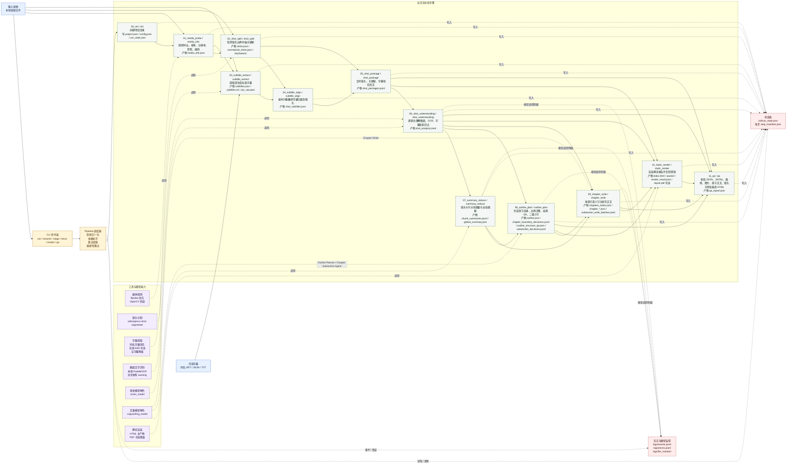
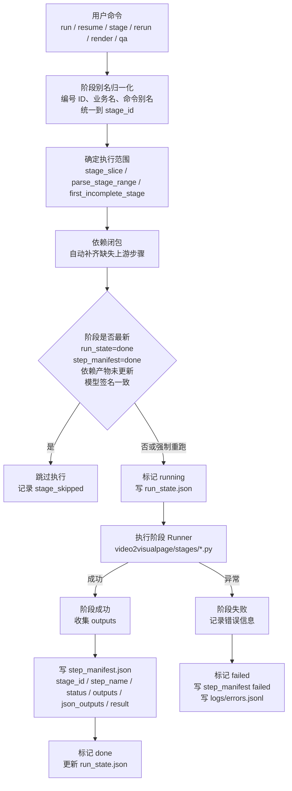
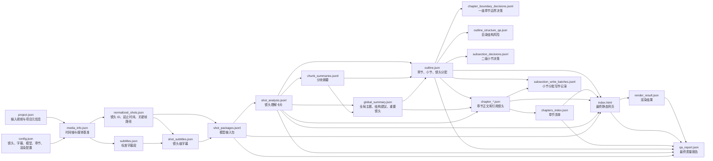

# Video2VisualPage 项目整体流程架构图

## 端到端流水线

```mermaid
flowchart LR
    Video["输入视频<br/>本地视频文件"]
    Sidecar["可选字幕<br/>同名 SRT / JSON / TXT"]

    CLI["CLI 命令层<br/>run / resume / stage / rerun / render / qa"]
    Scheduler["Pipeline 调度器<br/>阶段归一化<br/>依赖补齐<br/>断点续跑<br/>最新性跳过"]

    State["状态面<br/>init/run_state.json<br/>每步 step_manifest.json"]
    Logs["日志与模型监控<br/>logs/events.jsonl<br/>logs/errors.jsonl<br/>logs/llm_monitor/"]

    subgraph Tools["工具与模型能力"]
        MediaProbeTool["媒体探测<br/>ffprobe 优先<br/>OpenCV 兜底"]
        ShotTool["镜头分割<br/>utils/opencv-shot-segmenter"]
        SubtitleTool["字幕提取<br/>同名字幕优先<br/>在线 ASR 可选<br/>空字幕降级"]
        OCRTool["画面文字识别<br/>本地 PaddleOCR<br/>异常帧写 warning"]
        VisionModel["视觉模型角色<br/>vision_model"]
        CopyModel["文案模型角色<br/>copywriting_model"]
        RenderTool["静态渲染<br/>HTML 主产物<br/>PDF 可选降级"]
    end

    subgraph Pipeline["业务流水线步骤"]
        S00["00_init / init<br/>创建项目目录<br/>写 project.json / config.json / run_state.json"]
        S01["01_media_probe / media_info<br/>探测时长、帧率、分辨率、音频、编码<br/>产物 media_info.json"]
        S02["02_shot_split / shot_split<br/>检测镜头边界并抽关键帧<br/>产物 shots.json / normalized_shots.json / keyframes/"]
        S03["03_subtitle_extract / subtitle_extract<br/>提取或生成标准字幕<br/>产物 subtitles.json / subtitles.srt / asr_raw.json"]
        S04["04_subtitle_align / subtitle_align<br/>按时间重叠把字幕归属到镜头<br/>产物 shot_subtitles.json"]
        S05["05_shot_package / shot_package<br/>合并镜头、关键帧、字幕和前后文<br/>产物 shot_packages.jsonl"]
        S06["06_shot_understanding / shot_understanding<br/>逐镜头理解画面、OCR、字幕和知识点<br/>产物 shot_analysis.jsonl"]
        S07["07_summary_reduce / summary_reduce<br/>镜头卡片分块摘要与全局摘要<br/>产物 chunk_summaries.jsonl / global_summary.json"]
        S08["08_outline_plan / outline_plan<br/>生成章节目录、边界决策、结构 QA、二级小节<br/>产物 outline.json / chapter_boundary_decisions.jsonl / outline_structure_qa.json / subsection_decisions.jsonl"]
        S09["09_chapter_write / chapter_write<br/>按章节或小节分批写正文<br/>产物 chapters_index.json / chapter_*.json / subsection_write_batches.jsonl"]
        S10["10_static_render / static_render<br/>渲染静态报告并复制资源<br/>产物 index.html / assets/ / render_result.json / report.pdf 可选"]
        S11["11_qa / qa<br/>校验 JSON、JSONL、路径、图片、章节正文、镜头引用和最终 HTML<br/>产物 qa_report.json"]
    end

    Video --> CLI --> Scheduler --> S00
    S00 --> S01
    Video --> S01
    MediaProbeTool -.调用.-> S01

    S01 --> S02
    Video --> S02
    ShotTool -.调用.-> S02

    S01 --> S03
    Video --> S03
    Sidecar --> S03
    SubtitleTool -.调用.-> S03

    S02 --> S04
    S03 --> S04

    S02 --> S05
    S04 --> S05

    S05 --> S06
    OCRTool -.调用.-> S06
    VisionModel -.调用.-> S06

    S06 --> S07
    CopyModel -.调用.-> S07

    S06 --> S08
    S07 --> S08
    CopyModel -.Outline Planner / Chapter Subsection Agent.-> S08

    S08 --> S09
    S07 --> S09
    S06 --> S09
    CopyModel -.Chapter Writer.-> S09

    S09 --> S10
    S08 --> S10
    S06 --> S10
    S05 --> S10
    RenderTool -.调用.-> S10

    S10 --> S11
    S09 --> S11
    S08 --> S11
    S06 --> S11
    S05 --> S11

    Scheduler -.读取 / 更新.-> State
    S00 -.写入.-> State
    S01 -.写入.-> State
    S02 -.写入.-> State
    S03 -.写入.-> State
    S04 -.写入.-> State
    S05 -.写入.-> State
    S06 -.写入.-> State
    S07 -.写入.-> State
    S08 -.写入.-> State
    S09 -.写入.-> State
    S10 -.写入.-> State
    S11 -.写入.-> State

    Scheduler -.事件 / 错误.-> Logs
    S06 -.模型调用明细.-> Logs
    S07 -.模型调用明细.-> Logs
    S08 -.模型调用明细.-> Logs
    S09 -.模型调用明细.-> Logs

    classDef input fill:#e7f0ff,stroke:#2f66c5,color:#10233f
    classDef control fill:#fff4d6,stroke:#a06b00,color:#3d2600
    classDef stage fill:#f4f7f5,stroke:#4d7761,color:#102016
    classDef tool fill:#f3ecff,stroke:#6c48a8,color:#24153c
    classDef state fill:#ffecec,stroke:#ba4b4b,color:#3d1111

    class Video,Sidecar input
    class CLI,Scheduler control
    class S00,S01,S02,S03,S04,S05,S06,S07,S08,S09,S10,S11 stage
    class MediaProbeTool,ShotTool,SubtitleTool,OCRTool,VisionModel,CopyModel,RenderTool tool
    class State,Logs state
```

## 调度与重跑控制

```mermaid
flowchart TD
    Cmd["用户命令<br/>run / resume / stage / rerun / render / qa"]
    Normalize["阶段别名归一化<br/>编号 ID、业务名、命令别名统一到 stage_id"]
    Scope["确定执行范围<br/>stage_slice / parse_stage_range / first_incomplete_stage"]
    Deps["依赖闭包<br/>自动补齐缺失上游步骤"]
    Current{"阶段是否最新<br/>run_state=done<br/>step_manifest=done<br/>依赖产物未更新<br/>模型签名一致"}
    Skip["跳过执行<br/>记录 stage_skipped"]
    Running["标记 running<br/>写 run_state.json"]
    Runner["执行阶段 Runner<br/>video2visualpage/stages/*.py"]
    Success["阶段成功<br/>收集 outputs"]
    Failed["阶段失败<br/>记录错误信息"]
    Manifest["写 step_manifest.json<br/>stage_id / step_name / status / outputs / json_outputs / result"]
    Done["标记 done<br/>更新 run_state.json"]
    ErrorState["标记 failed<br/>写 step_manifest failed<br/>写 logs/errors.jsonl"]

    Cmd --> Normalize --> Scope --> Deps --> Current
    Current -- 是 --> Skip
    Current -- 否或强制重跑 --> Running --> Runner
    Runner -- 成功 --> Success --> Manifest --> Done
    Runner -- 异常 --> Failed --> ErrorState
```

## 项目产物目录

```mermaid
flowchart TB
    Root["outputs/{project_id}/<br/>单项目纯文件工作区"]

    Init["init/<br/>project.json<br/>config.json<br/>run_state.json<br/>step_manifest.json"]
    Media["media_info/<br/>media_info.json<br/>step_manifest.json"]
    Shot["shot_split/<br/>shots.json<br/>normalized_shots.json<br/>keyframes/<br/>step_manifest.json"]
    Subtitle["subtitle_extract/<br/>subtitles.json<br/>subtitles.srt<br/>asr_raw.json<br/>step_manifest.json"]
    Align["subtitle_align/<br/>shot_subtitles.json<br/>step_manifest.json"]
    Package["shot_package/<br/>shot_packages.jsonl<br/>step_manifest.json"]
    Understanding["shot_understanding/<br/>shot_analysis.jsonl<br/>step_manifest.json"]
    Summary["summary_reduce/<br/>chunk_summaries.jsonl<br/>global_summary.json<br/>step_manifest.json"]
    Outline["outline_plan/<br/>outline.json<br/>chapter_boundary_decisions.jsonl<br/>outline_structure_qa.json<br/>subsection_decisions.jsonl<br/>step_manifest.json"]
    Chapter["chapter_write/<br/>chapters_index.json<br/>chapter_*.json<br/>subsection_write_batches.jsonl<br/>step_manifest.json"]
    Render["static_render/<br/>index.html<br/>assets/style.css<br/>assets/images/<br/>render_result.json<br/>report.pdf 可选<br/>pdf_status.json 可选<br/>step_manifest.json"]
    QA["qa/<br/>qa_report.json<br/>step_manifest.json"]
    LogDir["logs/<br/>events.jsonl<br/>errors.jsonl<br/>llm_monitor/index.jsonl<br/>llm_monitor/health.json<br/>llm_monitor/by_function/*/"]

    Root --> Init
    Root --> Media
    Root --> Shot
    Root --> Subtitle
    Root --> Align
    Root --> Package
    Root --> Understanding
    Root --> Summary
    Root --> Outline
    Root --> Chapter
    Root --> Render
    Root --> QA
    Root --> LogDir

    Init -.兼容读取旧目录名.-> Legacy["旧编号目录兼容<br/>00_init / 01_media_probe / ... / 11_qa<br/>新产物统一写业务目录"]

    classDef root fill:#fff4d6,stroke:#a06b00,color:#3d2600
    classDef folder fill:#eef7f1,stroke:#4d7761,color:#102016
    classDef log fill:#ffecec,stroke:#ba4b4b,color:#3d1111
    classDef legacy fill:#f2f2f2,stroke:#777,color:#222

    class Root root
    class Init,Media,Shot,Subtitle,Align,Package,Understanding,Summary,Outline,Chapter,Render,QA folder
    class LogDir log
    class Legacy legacy
```

## 核心数据依赖

```mermaid
flowchart LR
    ProjectJson["project.json<br/>输入视频与项目元信息"]
    ConfigJson["config.json<br/>镜头、字幕、模型、章节、渲染配置"]
    MediaInfo["media_info.json<br/>时间轴与媒体基准"]
    NormalizedShots["normalized_shots.json<br/>镜头 ID、起止时间、关键帧路径"]
    Subtitles["subtitles.json<br/>标准字幕段"]
    ShotSubtitles["shot_subtitles.json<br/>镜头级字幕"]
    ShotPackages["shot_packages.jsonl<br/>模型输入包"]
    ShotAnalysis["shot_analysis.jsonl<br/>镜头理解卡片"]
    ChunkSummaries["chunk_summaries.jsonl<br/>分块摘要"]
    GlobalSummary["global_summary.json<br/>全局主题、结构建议、重要镜头"]
    Outline["outline.json<br/>章节、小节、镜头分配"]
    Boundary["chapter_boundary_decisions.jsonl<br/>一级章节边界决策"]
    StructureQA["outline_structure_qa.json<br/>目录结构风险"]
    SubsectionDecisions["subsection_decisions.jsonl<br/>二级小节决策"]
    Chapters["chapter_*.json<br/>章节正文和引用镜头"]
    ChapterIndex["chapters_index.json<br/>章节清单"]
    BatchLog["subsection_write_batches.jsonl<br/>小节分批写作记录"]
    HTML["index.html<br/>最终静态网页"]
    RenderResult["render_result.json<br/>渲染结果"]
    QAReport["qa_report.json<br/>最终质量报告"]

    ProjectJson --> MediaInfo
    ConfigJson --> MediaInfo
    MediaInfo --> NormalizedShots
    MediaInfo --> Subtitles
    NormalizedShots --> ShotSubtitles
    Subtitles --> ShotSubtitles
    NormalizedShots --> ShotPackages
    ShotSubtitles --> ShotPackages
    ShotPackages --> ShotAnalysis
    ShotAnalysis --> ChunkSummaries
    ShotAnalysis --> GlobalSummary
    ChunkSummaries --> GlobalSummary
    ShotAnalysis --> Outline
    ChunkSummaries --> Outline
    GlobalSummary --> Outline
    Outline --> Boundary
    Outline --> StructureQA
    Outline --> SubsectionDecisions
    Outline --> Chapters
    GlobalSummary --> Chapters
    ShotAnalysis --> Chapters
    Chapters --> ChapterIndex
    Outline --> BatchLog
    Chapters --> BatchLog
    Outline --> HTML
    ChapterIndex --> HTML
    Chapters --> HTML
    ShotAnalysis --> HTML
    ShotPackages --> HTML
    HTML --> RenderResult
    RenderResult --> QAReport
    HTML --> QAReport
    ChapterIndex --> QAReport
    Outline --> QAReport
    ShotAnalysis --> QAReport
    ShotPackages --> QAReport
```
